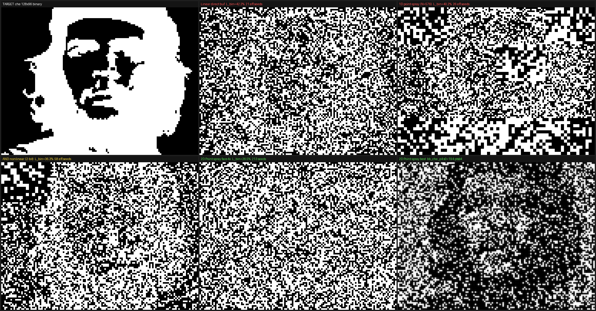

# Experiment: Direct Buffer vs Point-Spray — Nonlinearity Analysis

**Date:** 2026-03-31
**Target:** Che Guevara face, 128×96 binary, `media/prng_images/targets/che.pgm`
**Question:** Can direct buffer (LFSR-16 → 1 bit/block) match point-spray quality?

---

## Setup

All methods use the same **face4x segment hierarchy** and the same greedy search:
- L0: 1 seed, blk=4, full 128×96 (32×24 blocks × 4px each)
- L1: 4 seeds, blk=2, four 64×48 quadrants
- L2: 16 seeds, blk=1, sixteen 32×24 patches (1px blocks)
- L3+: additional passes up to 1205 seeds total

**Loss functions:**
- `L_bin` = pixel error rate (primary, canonical comparison metric)
- `L_gray` = 2×2 block grayscale error (secondary)

**Search:** all 65536 seeds tested per segment, best chosen greedily.
"Skip-if-worse" fix: only apply a seed if it improves the region error.

---

## Visual Comparison



*Red = bad, Yellow = partial improvement, Green = competitive with point-spray*

---

## Results

| Method | Seeds tried | Seeds applied | L_bin | Converges? |
|--------|------------|---------------|-------|-----------|
| Linear direct buf (LFSR-16) | 1205 | 1205 | 42.2% | No (oscillates ±1%) |
| 1D point-spray (N=576, LFSR-16) | 1205 | **26** | 40.2% | Plateau after 26 |
| AND-nonlinear (2-bit, LFSR-16) | 1205 | **58** | 36.3% | Plateau after 58 |
| **2D point-spray face4x (LFSR-32)** | **213** | **213** | **26.5%** | **Yes, monotone** |
| **2D point-spray quadtree (LFSR-32)** | **597** | **597** | **15.0%** | **Yes, monotone** |

---

## Convergence Curves

```
           L_bin error
50% ┤
    │  Linear: ████████████████████████ 42.2% → plateau (oscillates)
    │  AND:    █████████████████ 36.3% → plateau after 58 seeds
    │
    │  Spray:  █████████ 26.5% (213 seeds) → continues improving
25% ┤          ██████ 15.0% (597 seeds) → continues improving
    │
 0% ┴────────────────────────────────────────────────────────────
    0       100       200       400       600      1200 seeds
```

---

## Why Direct Buffer Fails

### Linear buffer: hits a wall after 21 seeds

LFSR-16 generates a **linear code** in GF(2)^768. All 65535 non-zero patterns form a
linear subspace of dimension ≤16.

**Consequence:** For any region (ox, oy, blk), there are only 65535 distinct patterns.
After one pass (seeds 1-21), the best pattern for each region has been found and applied.
Additional passes offer the same 65535 candidates — the argument is exact:

> Applying seed s2 on top of s1 produces combined pattern `s1 XOR s2`.
> But `s1 XOR s2` is another LFSR-16 pattern (linear codes are closed under XOR).
> This combined pattern was already evaluated in the pass-1 search.
> If it were better than s1, it would have been chosen then.

Result: all passes after the first are no-ops (with skip-if-worse fix) or cause
oscillation (without fix).

### AND-nonlinear: breaks linearity, but limited depth

Replacing `bit_i → block_i` with `bit_i AND bit_{i+1} → block_i`:
- P(flip) = 0.25 (vs 0.5 for linear)
- Quadratic dependence: `flip(i) = f_i(seed) · f_{i+1}(seed)` — nonlinear in GF(2)
- Pattern space is **not** a linear subspace → `s1 XOR s2` is NOT necessarily an
  AND-pattern from any single seed

This allows multiple passes to contribute genuinely new patterns.
Results: improves from 42.2% → 36.3%, with 58 effective seeds before saturation.

**Why still limited:** AND creates sparse patterns (25% flip density). The 65535 possible
AND-patterns cover a restricted region of the 2^768 pattern space. After 58 seeds,
this restricted region has been exhausted for all 21 non-overlapping patches.

---

## Why Point-Spray Converges

Point-spray generates **N random block indices** and XORs them:

```
flip(block j) = parity(number of times j was selected)
              = parity( Σᵢ 1[i-th random index == j] )
```

This is a **nonlinear function of the LFSR state**:
- The positions are generated by LFSR-32 (or LFSR-16 for 1D variant)
- The flip decision involves counting collisions — a polynomial of degree N in the seed bits
- Different seeds produce patterns that are NOT related by XOR

Each seed's "pattern space" is an independent draw from a high-dimensional distribution.
With 65536 possible seeds × 768 blocks, the effective pattern space is much richer
than any linear code.

**Result:** Greedy search finds genuine improvement at every seed because each new
pattern can express combinations that no previous single seed could.

---

## The Nonlinearity Ladder

| Method | Nonlinearity | P(flip) | Effective seeds | L_bin@213 |
|--------|-------------|---------|----------------|-----------|
| Linear | none (GF(2) linear) | 0.50 | **21** | 42.2% |
| 1D spray (N=576, LFSR-16) | degree-576, correlated | ≈0.39 | **26** | 40.2% |
| AND 2-bit | quadratic | 0.25 | **58** | 36.3% |
| 2D point-spray (LFSR-32) | degree-N, mixed | ≈0.39 | **213+** | **26.5%** |

**Unexpected finding:** 1D point-spray (26 eff. seeds) is *worse* than AND-nonlinear
(58 eff. seeds), despite 1D spray having higher polynomial degree (N=576 vs degree-2).

Reason: 1D spray uses 576 *consecutive* LFSR-16 steps, so the 576 indices are
highly autocorrelated. The diversity of patterns is limited by LFSR-16's linear
structure at the level of the 576-step sequence. AND-nonlinear, while lower degree,
introduces XOR-independence between pairs, giving more useful patterns overall.

**Key insight:** It's not just about the degree of nonlinearity — it's about
*independence* between the pattern-generating steps. 2D point-spray uses LFSR-32
with position extracted from non-adjacent bit slices (`state>>0` and `state>>16`),
creating near-independent (x,y) coordinates. This is what drives convergence.

---

## Formal Statement

**Theorem (informal):** Direct buffer with LFSR-16 cannot converge below ~42% on this
image class, regardless of segment structure or number of passes, because:

1. All 65535 patterns form a linear [768, 16] code over GF(2)
2. For non-overlapping regions, the greedy optimum is achieved after one pass
3. For overlapping regions (L0, L1 overlap with L2), combined XOR effects are
   already in the pattern space of single-seed search

Point-spray escapes this because its patterns are NOT in a linear subspace.
The minimum nonlinearity required appears to be: `flip = f(N random positions)` where
N ≥ 1 and positions are drawn non-deterministically from the seed.

---

## Files

| File | Description |
|------|-------------|
| `/tmp/buf_vs_spray.go` | Linear direct buffer experiment |
| `/tmp/buf_nonlinear.go` | AND-nonlinear (2-bit) experiment |
| `/tmp/buf_1dspray.go` | 1D point-spray experiment |
| `media/prng_images/buf_comparison.png` | Side-by-side visual comparison |
| `media/prng_images/targets/che.pgm` | 128×96 binary target |
