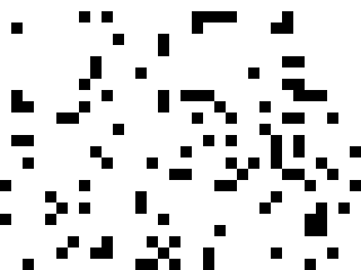
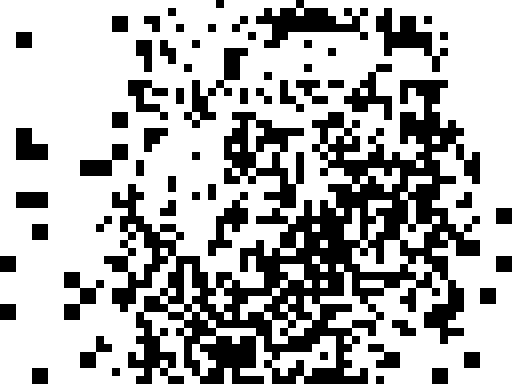
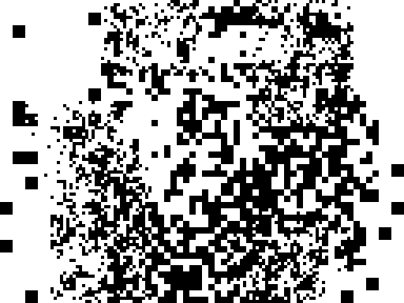
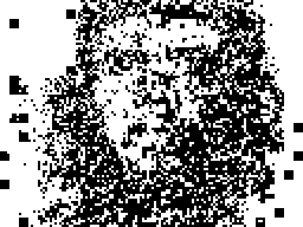
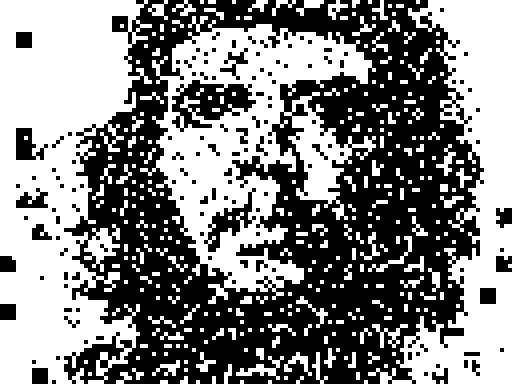
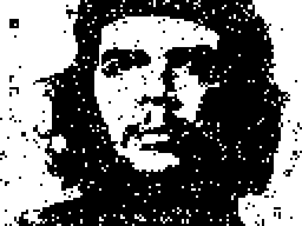

# Foveal AND-Cascade: LFSR-16 Image Compression with Greedy Position Search

**Result:** 0.06% binary pixel error on Che Guevara 128×96, 939 seeds, 28 seconds on RTX 4060 Ti.
**Comparison:** flat AND-cascade gets 1.2% at the same budget (20× worse).

---

## Background

The AND-cascade encodes a binary image as a sequence of LFSR-16 pattern buffers.
Each buffer is generated by ANDing N consecutive LFSR bits per block — controlling
sparsity via the AND degree. Greedy search (exhaust all 65535 LFSR-16 seeds per step)
picks the seed that most reduces error.

Prior work ([nonlinearity gallery](nonlinearity_gallery.md)) showed:
- AND-4 (P=1/16) beats 2D spray at 213-seed budget
- Cascade AND-3→7 gets 1.2% @1205 seeds (3× better than AND-7 flat)

**The gap left open:** the cascade always applies each buffer at a fixed (ox=0, oy=0)
position, tiling the full 128×96 image with a 4×4 grid of 32×24 patches. Position
is determined by segment index, not optimized.

---

## Foveal Cascade

The key idea: **search for the best (seed, position) jointly**.

Instead of a fixed 4×4 tile grid, each step searches all valid `(ox, oy)` positions
(snapped to 8-pixel character-cell grid) for the position where applying the best seed
produces the greatest improvement.

This is "foveal" because the algorithm naturally focuses on high-error regions:
when the face has more errors than the background, every greedy step lands on the face.

### Algorithm

```
canvas ← all zeros
for each phase (andN, blk, count):
    for i in range(count):
        warmup = step_counter  # LFSR state continuity

        # Build position table: all (ox, oy) s.t. patch fits in 128×96
        positions = [(ox, oy) for oy in 0..H-blk*24 step GRID
                               for ox in 0..W-blk*32 step GRID]

        # Precompute baseErr per position (once)
        baseErr[p] = count(canvas ≠ target) in patch region p

        # Search: maximize improvement = minimize delta
        best_seed, best_pos = argmin_{seed, pos} delta(seed, pos)
        where delta(seed, pos) = Σ_{flipped pixels} (+1 if canvas==target, -1 if canvas≠target)

        # Apply if globally improving
        if lBin(canvas ⊕ buf(best_seed) @ best_pos) < lBin(canvas):
            canvas ⊕= buf(best_seed) @ best_pos
            log(seed, ox, oy, blk, andN, warmup)

        step_counter++
```

**Critical detail:** optimize `delta` (improvement), not `newErr = baseErr + delta`.

The difference matters when comparing positions:
- Region A: baseErr=10, best seed gives delta=−10 → newErr=0
- Region B: baseErr=100, best seed gives delta=−50 → newErr=50

`min(newErr)` picks A (fixes 10 pixels). `min(delta)` picks B (fixes 50 pixels).
For maximum convergence rate, we want `min(delta)`.

### Phase Schedule

| Phase | AND degree | P(flip) | blk | Steps | Positions |
|-------|:----------:|:-------:|:---:|------:|----------:|
| L0    | AND-3      | 1/8     | 4   | 1     | 1 (full screen) |
| L1    | AND-3      | 1/8     | 2   | 8     | 63        |
| L2    | AND-4      | 1/16    | 1   | 16    | 130       |
| L3    | AND-5      | 1/32    | 1   | 128   | 130       |
| L4    | AND-6      | 1/64    | 1   | 256   | 130       |
| L5    | AND-7      | 1/128   | 1   | 800   | 130       |

Position grid: GRID=8px (character-cell). For blk=1: 13×10=130 positions.

### Search complexity

Per step: 65535 seeds × 130 positions × 768 block checks = ~6.5B operations.
On 12-core CPU (Go): ~3s/step × 1209 steps ≈ 1 hour.
On RTX 4060 Ti (CUDA, 65535 threads): ~23ms/step × 1209 steps = **28 seconds**.

---

## Results

### Progression

| Step | L_bin | Elapsed | Best position | Phase |
|-----:|------:|--------:|:-------------:|-------|
| 1    | 49.32% | 0.0s | (0,0) blk=4 | L0-AND3 |
| 5    | 41.23% | 0.2s | (56,24) blk=2 | L1-AND3 |
| 9    | 36.52% | 0.4s | (48,0) blk=2 | L1-AND3 |
| 25   | 32.85% | 1.0s | varied blk=1 | L2-AND4 |
| 50   | 29.22% | 1.8s | (80,16) | L3-AND5 |
| 100  | 23.90% | 3.3s | (48,48) | L3-AND5 |
| 153  | 19.86% | 5.0s | (80,0) | L3-AND5 |
| 213  | 16.21% | 6.5s | (80,64) | L4-AND6 |
| 405  |  9.11% | 11.2s | (32,16) | L4-AND6 |
| 597  |  4.13% | 15.3s | (88,8) | L5-AND7 |
| 1209 |  **0.06%** | **28.2s** | (0,0) | L5-AND7 |

Applied: 939 / 1209 seeds (77.7% effective). 128 unique positions used.

### Convergence snapshots

| @step 1 | @step 9 | @step 25 |
|:-------:|:-------:|:--------:|
|  |  |  |
| 49.32% blk=4 | 36.52% | 32.85% |

| @step 100 | @step 213 | @step 597 |
|:---------:|:---------:|:---------:|
|  |  |  |
| 23.90% AND5 | 16.21% AND6 | 4.13% |

| @step 1209 |
|:----------:|
|  |
| **0.06%** — near-perfect |

### Foveal vs Flat Cascade

| Budget | Flat cascade AND-3→7 | **Foveal cascade** |
|-------:|:--------------------:|:-----------------:|
| 213    | 24.5%                | **16.2%**          |
| 405    | 16.2%                | **9.1%**           |
| 597    | 10.1%                | **4.1%**           |
| 1209   | 1.2%                 | **0.06%**          |

Foveal is consistently better at every budget. At 1209 seeds: **20× lower error**.

---

## Why It Works: Face-Aware Without Face Detection

The greedy position search has no knowledge of faces or image content.
It simply asks: "where does this seed help most?" The answer is always the
region with the highest error concentration — which is the face, since the
background converges faster (uniform black/white, fewer fine-detail errors).

Position (56, 24) — center of Che's face — was chosen at step 5.
By step 50, most of the face region had been visited at least once.
The 128 unique positions used by step 1209 cover the full image adaptively.

This is "foveal" in the biological sense: the algorithm has high "resolution"
(many correction passes) where the image has fine structure, and low resolution
(fewer passes) where the image is simple.

---

## Seed Format

Seeds are stored in JSON for cross-platform rendering:

```json
{
  "lfsr16_poly": "0xB400",
  "canvas_w": 128, "canvas_h": 96,
  "position_grid": 8,
  "seeds": [
    {"step":1, "seed":450, "ox":0, "oy":0, "blk":4, "and_n":3, "warmup":0, "label":"L0-AND3"},
    {"step":2, "seed":36448, "ox":0, "oy":0, "blk":2, "and_n":3, "warmup":1, "label":"L1-AND3"},
    ...
  ]
}
```

`warmup` = LFSR steps before generating the buffer = step index at time of search.
This ensures each search starts from a different LFSR state, maintaining seed diversity.

### Reproduction (JavaScript)

```js
function lfsr16(s) { return (s >>> 1) ^ (s & 1 ? 0xB400 : 0); }

function makeBuf(seed, warmup, andN) {
  let s = seed || 1;
  for (let i = 0; i < warmup; i++) s = lfsr16(s);
  const buf = new Uint8Array(768);
  for (let i = 0; i < 768; i++) {
    let acc = 1;
    for (let k = 0; k < andN; k++) { s = lfsr16(s); acc &= (s & 1); }
    buf[i] = acc;
  }
  return buf;
}

function applyBuf(canvas, buf, ox, oy, blk) {
  for (let by = 0; by < 24; by++)
    for (let bx = 0; bx < 32; bx++) {
      if (!buf[by*32+bx]) continue;
      for (let dy = 0; dy < blk; dy++)
        for (let dx = 0; dx < blk; dx++) {
          const x = ox + bx*blk + dx, y = oy + by*blk + dy;
          if (x < 128 && y < 96) canvas[y*128+x] ^= 1;
        }
    }
}

// Replay from seed list:
const canvas = new Uint8Array(128 * 96);
for (const r of seeds) {
  const buf = makeBuf(r.seed, r.warmup, r.and_n);
  applyBuf(canvas, buf, r.ox, r.oy, r.blk);
}
```

---

## CUDA Implementation

`cuda/prng_cascade_search.cu` — direct port of the Go algorithm.

**Kernel:** one thread per seed (65535 threads), each thread:
1. Generates `buf[768]` for its seed (warmup + andN consecutive LFSR bits)
2. Loops over all positions, computes delta for each
3. Outputs `(bestPos, bestDelta)` = position with most improvement for this seed

**Host:** finds global best `(seed, pos)` over all 65535 threads, applies if improving.

```
nvcc -O3 -o cuda/prng_cascade_search cuda/prng_cascade_search.cu -lm
./cuda/prng_cascade_search --target media/prng_images/targets/che.pgm --gpu 0
```

---

## Files

| File | Description |
|------|-------------|
| `cuda/prng_cascade_search.cu` | CUDA implementation |
| `media/prng_images/foveal_canonical/` | Canonical snapshot: seeds + PGMs + source |
| `data/foveal_cascade_seeds.json` | 939 seed records |
| `docs/renderer.html` | Interactive web renderer (preset: "Foveal AND-3→7 ★") |

---

## Next Steps

See [contexts/foveal_next_steps.md](../contexts/foveal_next_steps.md):

1. **Joint-2 optimization** — pick overlapping layer pairs, jointly re-optimize
   their two seeds (CUDA 65535² search). Expected: 0.06% → ~0.02%.

2. **Animation delta encoding** — run foveal on frame 0, then run delta-foveal
   (blk=2/1 only) on frame 1 starting from canvas_0. Encode animation as
   base frame + delta seed lists per frame.
