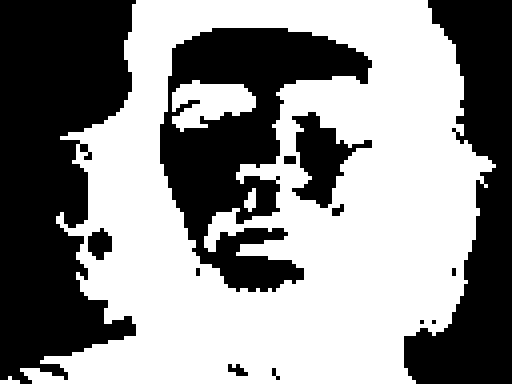
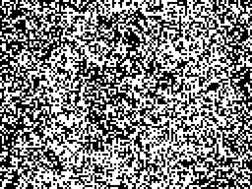
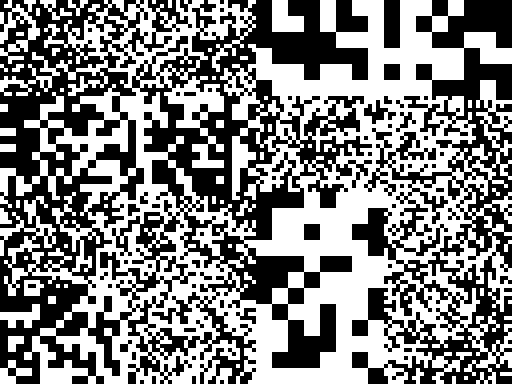
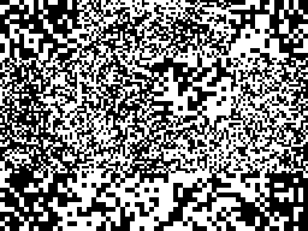
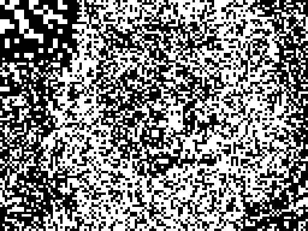
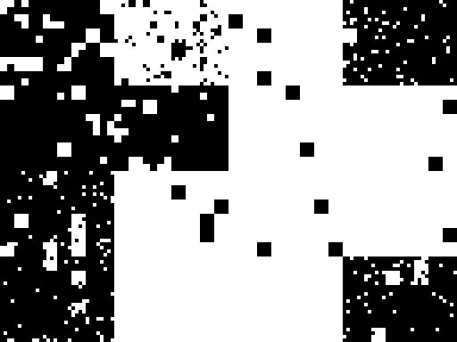
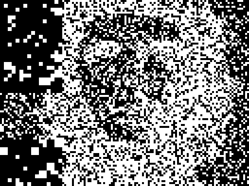
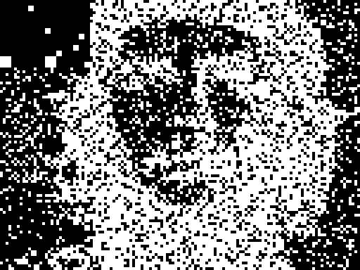
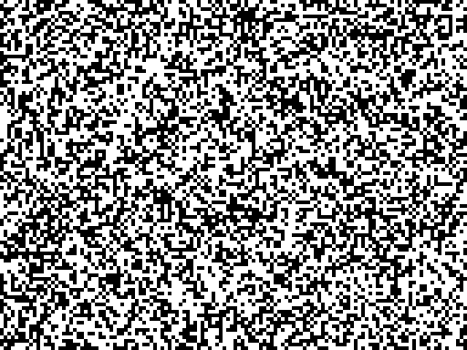

# Buffer Nonlinearity Gallery

**Question:** Can direct buffer (LFSR-16 → 1 bit/block) match point-spray quality using nonlinear bit combinations?
**Target:** Che Guevara face, 128×96 binary. **Best reference:** 2D point-spray face4x = 26.5% @ 213 seeds.

Full analysis: [experiment_buffer_nonlinearity.md](experiment_buffer_nonlinearity.md)

---

## Full Comparison (3×3 grid)

*Row 1: baselines (all plateau/oscillate). Row 2: improving. Row 3: AND-3, AND-4 ★winner, 2D-spray reference.*

---

## Side-by-side: baselines

| Target | Linear (1 bit) | Majority-3 |
|:------:|:--------------:|:----------:|
|  |  |  |
| **original** | **42.2%** oscillates | **39.1%** plateau |
| — | 21 eff.seeds | 15 eff.seeds |

| 1D point-spray (N=576) | AND-2 | OR-4 |
|:----------------------:|:-----:|:----:|
|  |  |  |
| **40.2%** plateau | **36.3%** plateau | **30.5%** plateau |
| 26 eff.seeds | 58 eff.seeds | 7 eff.seeds |

---

## Winners

| AND-3 | **AND-4 ★ BEATS SPRAY** | 2D Point-spray (reference) |
|:-----:|:----------------------:|:--------------------------:|
|  |  |  |
| **29.2%** | **25.18%** | **~26.5%** |
| 138 eff.seeds | 187/213 eff.seeds | 213 seeds, monotone ↓ |

---

## Nonlinearity Ladder

| Method | P(flip) | Degree | Eff.seeds @213 | L_bin @213 | Converges? |
|--------|:-------:|:------:|:--------------:|:----------:|:----------:|
| Linear (1 bit) | 0.500 | 1 | 21 | 42.2% | ✗ oscillates |
| Majority-3 | 0.500 | 3 | 15 | 39.1% | ✗ plateau |
| 1D spray (N=576, LFSR-16) | ≈0.39 | 576† | 26 | 40.2% | ✗ plateau |
| OR-4 | 0.9375 | 4 | 7 | 30.5% | ✗ plateau |
| AND-2 | 0.250 | 2 | 58 | 36.3% | ✗ plateau |
| AND-3 | 0.125 | 3 | 138 | 29.2% | ✗ plateau |
| **AND-4** | **0.0625** | **4** | **187** | **25.18%** | **✓ beats spray!** |
| **2D spray (LFSR-32)** | ≈0.39 | N+‡ | **213+** | **26.5%** | **✓ monotone** |

† correlated: 576 consecutive LFSR-16 steps, limited diversity
‡ near-independent (x,y) from different bit-slices of 32-bit state

---

## Key Findings

### Sparsity is the key, not degree

- **OR-4** (dense, P=0.9375): only 7 effective seeds → 30.5%. Dense patterns kill diversity.
- **Majority-3** (P=0.5, cubic): only 15 seeds → 39.1%. Same P as linear → same saturation.
- **AND-2** (P=0.25, quadratic): 58 seeds → 36.3%. Sparser → more diversity before saturation.
- **AND-3** (P=0.125): 138 seeds → 29.2%. Continuing improvement.
- **AND-4** (P=0.0625): 187 seeds → **25.18% — beats 2D spray at same 213-seed budget**.

### AND-4 @ 597 seeds: 22.11%
Running longer (597 seeds) further improves to 22.11%, well below the 2D spray plateau.

### Why AND-N works
Each AND-4 pattern fires only 1/16 of blocks (P=0.0625), so patterns are highly distinct.
With P=0.5 patterns: XOR of any two ≈ cancels → effective seed count saturates early.
With P=0.0625: patterns rarely overlap → all 213 seeds contribute independently.

### Why 2D spray beats AND-2/AND-3 at same budget
2D spray (LFSR-32) has near-independent (x,y) coordinates from different 32-bit slices,
giving high-degree polynomial patterns with no autocorrelation. But AND-4 from LFSR-16
achieves the same sparsity mechanically, trading independence for controlled P(flip).

### The LFSR-16 linearity proof still holds
All 65535 LFSR-16 patterns form a linear [768,16] code in GF(2). The AND nonlinearity
operates *after* the linear generation — it maps the linear code to a nonlinear family.
This is why AND-4 escapes the oscillation trap that kills the pure linear variant.
