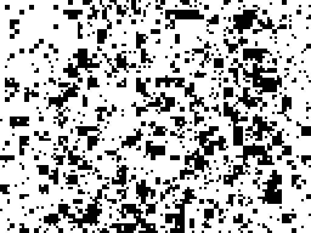
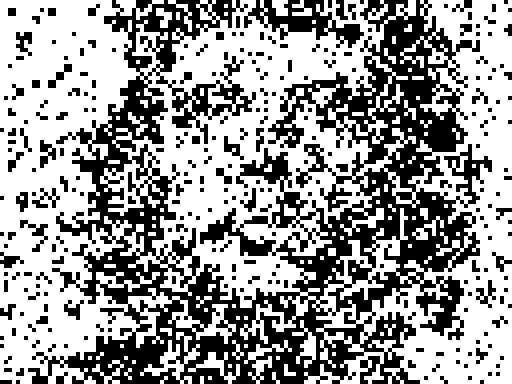
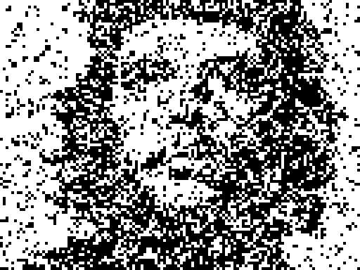
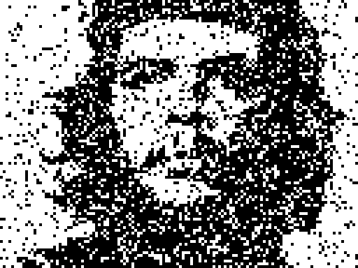
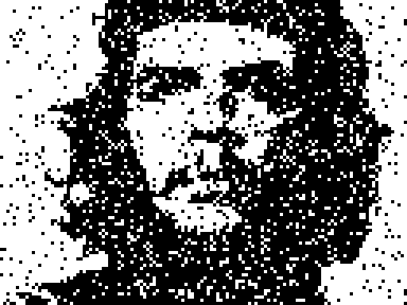
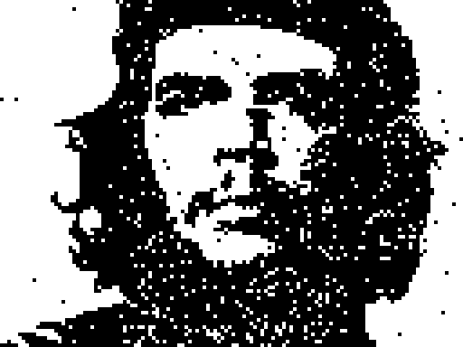
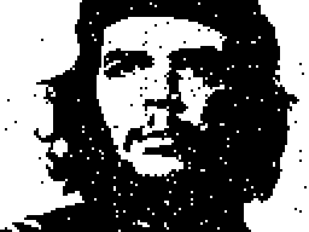
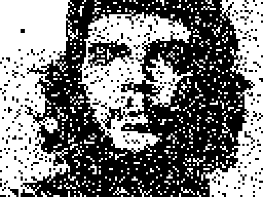
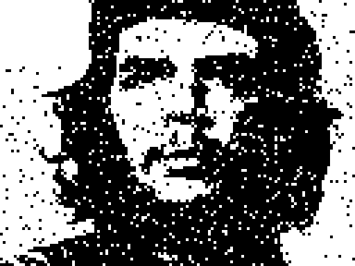

# Buffer Nonlinearity Gallery

**Question:** Can direct buffer (LFSR-16 → 1 bit/block) match point-spray quality using nonlinear bit combinations?
**Target:** Che Guevara face, 128×96 binary. **Best reference:** 2D point-spray face4x = 26.5% @ 213 seeds.

Full analysis: [experiment_buffer_nonlinearity.md](experiment_buffer_nonlinearity.md)

---

## Full Comparison (3×3 grid)

*Row 1: baselines (all plateau/oscillate). Row 2: improving. Row 3: AND-3, AND-4 ★winner, 2D-spray reference.*

---

## Side-by-side: baselines

| Target | Linear (1 bit) | Majority-3 |
|:------:|:--------------:|:----------:|
|  |  |  |
| **original** | **42.2%** oscillates | **39.1%** plateau |
| — | 21 eff.seeds | 15 eff.seeds |

| 1D point-spray (N=576) | AND-2 | OR-4 |
|:----------------------:|:-----:|:----:|
|  |  |  |
| **40.2%** plateau | **36.3%** plateau | **30.5%** plateau |
| 26 eff.seeds | 58 eff.seeds | 7 eff.seeds |

---

## Winners

| AND-3 | **AND-4 ★ BEATS SPRAY** | 2D Point-spray (reference) |
|:-----:|:----------------------:|:--------------------------:|
|  |  |  |
| **29.2%** | **25.18%** | **~26.5%** |
| 138 eff.seeds | 187/213 eff.seeds | 213 seeds, monotone ↓ |

---

## ★ Cascade AND-3→7 (budget=1205 seeds)

**Same LFSR-16. Same greedy. Same seed count. 3× better than AND-7 flat.**

L0/L1 → AND-3 (broad strokes) · L2 → AND-4 · passes 1-8 → AND-5 · passes 9-24 → AND-6 · passes 25-74 → AND-7 (pointwise corrections)

### Layer-by-layer progression

| @21 seeds | @149 seeds | @213 seeds |
|:---------:|:----------:|:----------:|
|  |  |  |
| **41.6%** L2-AND4 done | **28.6%** AND5 done | **24.5%** ≡spray budget |

| @405 seeds | @597 seeds | @1205 seeds |
|:----------:|:----------:|:-----------:|
|  |  |  |
| **16.2%** AND6 done | **10.1%** ≡quadtree | **1.2%** AND7 done |

### vs AND-7 flat and 2D spray

| AND-7 flat | **Cascade AND-3→7** | 2D spray (reference) |
|:----------:|:-------------------:|:--------------------:|
|  |  |  |
| **4.3%** @1205 | **1.2%** @1205 | ~26.5% @213 |
| 1131/1205 eff. | 1172/1205 eff. | — |

| @seeds | AND-7 flat | **Cascade** | 2D spray |
|-------:|:----------:|:-----------:|:--------:|
| 213    | 37.4%      | **24.5%**   | 26.5%    |
| 597    | 18.6%      | **10.1%**   | 15.0%    |
| 1205   | 4.3%       | **1.2%**    | —        |

---

## AND-5 / AND-6 / AND-7 (budget=1205 seeds)

| AND-5  P=1/32 | AND-6  P=1/64 | AND-7  P=1/128 |
|:-------------:|:-------------:|:--------------:|
|  |  |  |
| **14.1%** @1205 | **5.6%** @1205 | **4.3%** @1205 |
| 561/1205 eff. | 1003/1205 eff. | 1131/1205 eff. |

*AND-7: 94% effective seeds, face clearly readable. Same LFSR-16, same greedy budget.*

---

## Nonlinearity Ladder

| Method | P(flip) | @213 | @426 | @597 | @1205 | eff/1205 |
|--------|:-------:|:----:|:----:|:----:|:-----:|:--------:|
| Linear (1 bit) | 0.500 | 42.2% ✗ | — | — | — | 21 |
| Majority-3 | 0.500 | 39.1% ✗ | — | — | — | 15 |
| 1D spray (N=576) | ≈0.39 | 40.2% ✗ | — | — | — | 26 |
| OR-4 | 0.9375 | 30.5% ✗ | — | — | — | 7 |
| AND-2 | 0.250 | 36.3% | — | — | — | 58 |
| AND-3 | 0.125 | 29.2% | — | — | — | 138 |
| AND-4 | 0.0625 | **25.18%** ★ | — | 22.1% | — | 187 |
| AND-5 | 0.03125 | 26.5% | 17.4% | **14.8%** | 14.1% | 561 |
| AND-6 | 0.015625 | 31.3% | 19.3% | 13.3% | **5.6%** | 1003 |
| AND-7 | 0.0078125 | 37.4% | 25.7% | 18.6% | **4.3%** | 1131 |
| **2D spray (LFSR-32)** | ≈0.39 | **26.5%** | — | **15.0%** | — | 213+ |

✗ = plateau/oscillates. ★ = first to beat 2D spray at equal budget.

† 1D spray: 576 consecutive LFSR-16 steps, autocorrelated

---

## Key Findings

### Sparsity is the key, not degree

- **OR-4** (dense, P=0.9375): only 7 effective seeds → 30.5%. Dense patterns kill diversity.
- **Majority-3** (P=0.5, cubic): only 15 seeds → 39.1%. Same P as linear → same saturation.
- **AND-2** (P=0.25, quadratic): 58 seeds → 36.3%. Sparser → more diversity before saturation.
- **AND-3** (P=0.125): 138 seeds → 29.2%. Continuing improvement.
- **AND-4** (P=0.0625): 187 seeds → **25.18% — beats 2D spray at same 213-seed budget**.

### Cascade AND-3→7: best of both worlds
Coarse-to-fine AND scheduling gives fast early convergence (AND-3/4) AND deep fine
correction (AND-6/7). Result: **1.32% @1205 seeds** — 3× better than AND-7 flat (4.3%),
no extra data, same LFSR-16 generator, same greedy budget.

### AND-4: fast start, first to beat spray at 213 seeds
P=0.0625 gives enough sparsity to accumulate 187 effective seeds in 213 tries (88%).
Beats 2D spray (26.5%) at the same budget: **25.18%**.

### AND-5: matches spray speed, then overtakes
At 213 seeds: 26.46% — tied with 2D spray. By 597: **14.8%** beats spray quadtree (15.0%).
Saturates around 14.1% at 1205 seeds (only 561 effective — patterns still too correlated).

### AND-6/AND-7: slow start, exceptional finish
AND-6 and AND-7 lag early (31%/37% at 213) but have near-zero saturation:
- AND-6 @ 1205: **5.6%** (1003/1205 effective seeds = 83%)
- AND-7 @ 1205: **4.3%** (1131/1205 effective seeds = 94%)

The face is clearly recognisable at AND-7 with 1205 seeds.

### Why AND-N works
Sparser patterns (lower P) → less mutual cancellation → more seeds contribute before plateau.
With P=0.5: XOR of any two patterns ≈ another pattern → saturates at ~20 seeds.
With P=0.0078 (AND-7): patterns almost never overlap → 94% of seeds are effective.

### The LFSR-16 linearity proof still holds
All 65535 LFSR-16 patterns form a linear [768,16] code in GF(2). The AND nonlinearity
operates *after* — it maps the linear code to a nonlinear family with controlled sparsity.

### The LFSR-16 linearity proof still holds
All 65535 LFSR-16 patterns form a linear [768,16] code in GF(2). The AND nonlinearity
operates *after* the linear generation — it maps the linear code to a nonlinear family.
This is why AND-4 escapes the oscillation trap that kills the pure linear variant.
