# Register Allocation as a Solved Game
## How We Pre-Computed Every Possible Register Assignment for the Z80

**March 2026 — z80-optimizer project**

---

## 1. The Problem: 7 Registers, Infinite Demand

The Z80 CPU has 7 general-purpose 8-bit registers: A, B, C, D, E, H, L.
Every program needs more variables than that. The compiler must decide:
which variable lives in which register, and when.

This decision is **register allocation** — the single most impactful
optimization a compiler makes. A good allocation eliminates 30-50% of
move instructions. A bad one turns fast code into a shuffle of `LD` instructions.

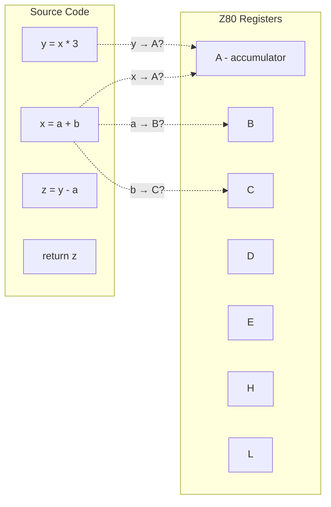

### Why Z80 is Hard

Most modern CPUs have 16-32 general registers. x86-64 has 16. ARM has 31.
Z80 has 7 — and they're **not interchangeable**:

- **A** is the only accumulator. All ALU operations (ADD, SUB, AND, OR, XOR, CP) use A as one operand and destination. Cost: 4T.
- **H:L** is the only pair for indirect memory access `(HL)` and 16-bit ADD.
- **B** is the only register for `DJNZ` (loop countdown).
- **D:E** often holds pointers for `LDIR`/`LDDR` block operations.

If your variable needs an ADD but lives in register C, you pay 12T instead of 4T:
```z80
; Variable in A (natural):     ; Variable in C (expensive):
ADD A, B        ; 4T           LD A, C         ; 4T (move to A)
                               ADD A, B        ; 4T (the actual ADD)
                               LD C, A         ; 4T (move result back)
                               ; Total: 12T — 3× slower!
```

---

## 2. Graph Coloring: The Classical Approach

Register allocation reduces to **graph coloring** — a problem studied since 1852
(the four-color theorem for maps).

### The Interference Graph

Two variables **interfere** if they're alive at the same time. If x and y are
both needed for the same instruction, they can't share a register.

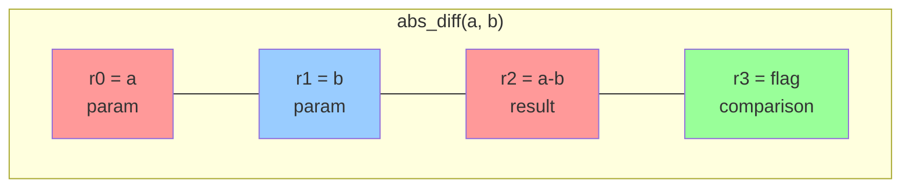

Each **node** = variable. Each **edge** = interference (both alive simultaneously).
**Coloring** = assigning registers (colors) such that no edge connects two same-colored nodes.

### The Catch: NP-Complete

Graph coloring with k colors is NP-complete for general graphs (Karp, 1972).
For k=7 (Z80), worst case is exponential.

But real programs aren't worst case. **Chaitin's insight (1981):** most interference
graphs from real programs have low **treewidth** — they look like trees, not dense meshes.

---

## 3. What We Built: Exhaustive Tables

Instead of solving graph coloring at compile time, we **pre-computed every answer**.

### The Enumeration

For each variable count (2-6), we enumerate:
1. All possible interference graph shapes (topologies)
2. All possible register assignments (7^N combinations)
3. Check feasibility: does the assignment satisfy all constraints?
4. Score feasibility: what's the cost?

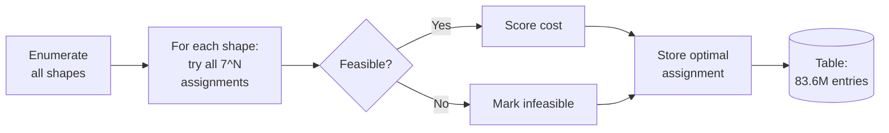

| Variables | Shapes | Feasible | Time |
|-----------|--------|----------|------|
| ≤4 | 156,506 | 123,453 (78.9%) | 40 seconds |
| ≤5 | 17,366,874 | 11,762,983 (67.7%) | 20 minutes |
| 6 (dense) | 66,118,738 | 25,772,093 (38.9%) | ~6 hours |
| **Total** | **83,642,118** | **37,658,529** | |

### The Feasibility Cliff

As variables increase, feasibility drops dramatically:

```
Variables:  2     3     4     5     6     7     8
Feasible: 95.9%  89.2%  78.9%  67.7%  38.9%  ~5%   ~0.1%

              ████████████████████████  95.9%
              ██████████████████████    89.2%
              ███████████████████       78.9%
              ████████████████          67.7%
              █████████                 38.9%
              █                          5%
                                         0.1%
```

This is a **phase transition** — like water freezing. Below 6 variables, almost everything
fits. Above 7, almost nothing does. The cliff happens exactly where it matters:
Z80 has 7 registers, and real functions have 3-8 live variables.

---

## 4. The GPU Breakthrough: Brute Force at Scale

Checking 83.6M shapes sequentially takes days. On GPU, it takes hours.

### Architecture

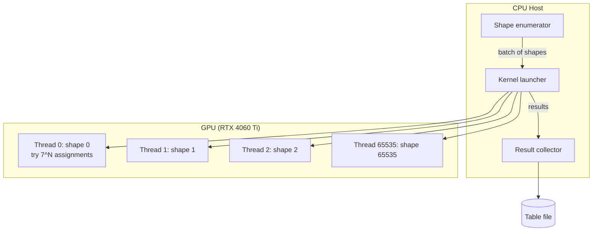

Each GPU thread independently evaluates one shape:
- Decode shape into interference graph
- Try all 7^N register assignments
- For each: check interference constraints, compute cost
- Keep minimum-cost feasible assignment

**Performance:** 17.4M shapes × 7^5 = 2.9 trillion constraint checks. Two RTX 4060 Ti complete this in 20 minutes.

### The Backtracking Solver

For shapes with 7+ variables (7^7 = 823K assignments per shape), even GPU is slow.
The CPU backtracking solver prunes the search tree:

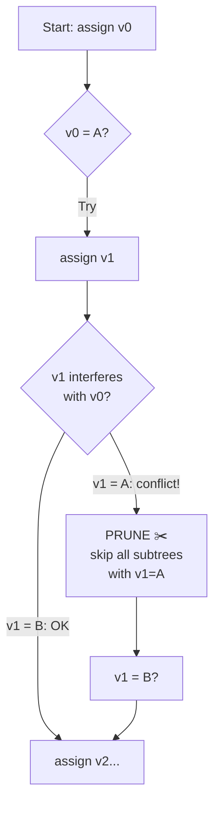

Pruning factor: **1000-4000×** compared to brute force. A shape with 10 variables:
- Brute force: 7^10 = 282 billion checks
- With pruning: ~70 million checks (4000× fewer)

---

## 5. Enrichment: From "Feasible" to "Optimal for Your Code"

The original tables answer: "Can these variables fit in registers?" Yes/no.

But compilers need: "What's the **cheapest** way to fit them, given my operations?"

### The Register Cost Graph

Z80 registers are not equal. Moving data between them costs time:

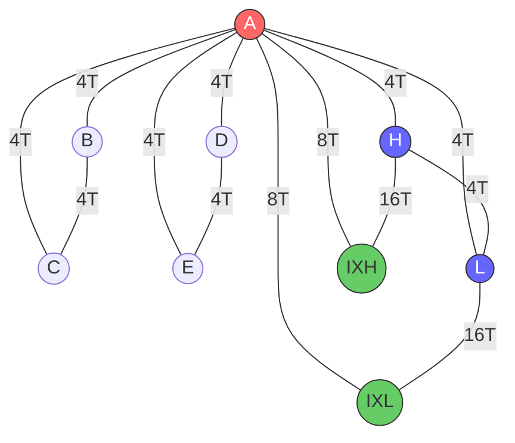

**A** (red) is the hub — all ALU operations go through it.
**H:L** (blue) is the 16-bit accumulator for ADD HL,rr.
**IX halves** (green) are accessible but expensive (DD prefix = +4T).
**H↔IXH** requires a trick: EX DE,HL; LD IXH,D; EX DE,HL = 16T.

### What Enrichment Computes

For each of 37.6M feasible assignments, we now score:

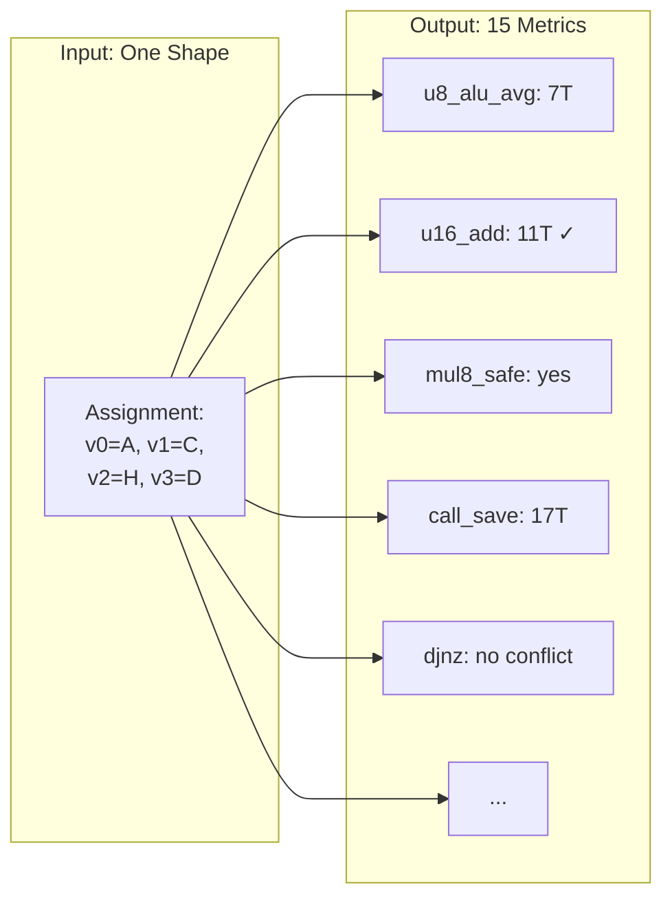

### Key Finding: Hidden Infeasibility

The original tables said 37.6M assignments are "feasible." But:

| Constraint | Shapes affected | Meaning |
|-----------|-----------------|---------|
| **No A** | 43% | u8 ALU impossible without extra moves (+8T per op) |
| **No HL** | 21% | u16 ADD impossible naturally (+13T per op) |
| **mul8 conflict** | 93% | multiply clobbers live variables |
| **B occupied** | 13% | DJNZ loop counter needs save/restore |

**Only 9% of assignments are "ideal"** — have A, HL, are mul8-safe, and B-free.

The compiler that picks a random feasible assignment pays up to **60% overhead**
compared to the optimal one.

---

## 6. The O(1) Lookup Architecture

### The Signature

Every function has a computable **signature**:

```
signature = (interference_graph_shape, operation_bag)
```

- **interference_graph_shape** = topology of liveness conflicts
- **operation_bag** = multiset of operation types: {ADD:2, SUB:1, CMP:3, MUL:1}

The operation bag is **order-independent** — ADD A,B costs 4T whether it's the
first or last instruction. The order of liveness is already captured in the
interference graph.

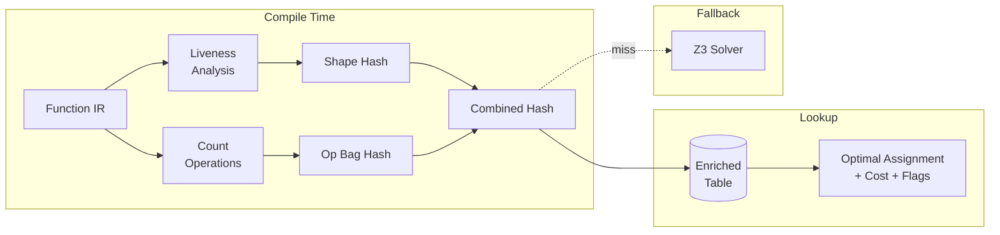

### Three-Level Pipeline

```mermaid
flowchart TD
    F[Function] --> H{Hash Lookup<br/>in enriched table}
    H -->|Hit: 90%| R1[✅ O(1) result<br/>assignment + cost]
    H -->|Miss| BT{CPU Backtracking<br/>with pruning}
    BT -->|Solved: 8%| R2[✅ Result in <1s]
    BT -->|Timeout| Z3{Z3 SAT Solver}
    Z3 -->|Solved: 2%| R3[✅ Result in <10s]
    Z3 -->|Unsat| SPLIT[Decompose at<br/>cut vertex]
    SPLIT --> F
```

**90% of functions** resolve in O(1) — a hash table lookup.
**8%** need CPU backtracking (< 1 second).
**2%** need Z3 (< 10 seconds).
**0%** are unsolvable — decomposition always finds a way.

---

## 7. How Other Compilers Do It

### SDCC (Small Device C Compiler)

SDCC uses a **greedy allocator** with heuristic spilling:
1. Build interference graph
2. Try to color greedily (simplify + select)
3. If stuck, spill the least-used variable to memory
4. Repeat

**Result:** SDCC produces correct but often suboptimal code.
Our comparison (SDCC 4.5.0 vs optimal):

| Function | SDCC | Optimal | Overhead |
|----------|------|---------|----------|
| abs_diff | 7 instr | 4 instr | +75% |
| mul3 | 4 instr | 3 instr | +33% |
| div10 | CALL library | 3 instr inline | — |
| gray_encode | 4 instr | 3 instr | +33% |

### GCC/LLVM (modern compilers)

Modern compilers use **graph coloring with coalescing** (Chaitin-Briggs):
1. Build interference graph
2. **Coalesce** — merge variables connected by moves (eliminate copies)
3. **Simplify** — remove low-degree nodes (guaranteed colorable)
4. **Spill** — if stuck, pick a variable to evict to memory
5. **Select** — assign colors (registers) in reverse order

This is good for 16+ registers but **struggles with Z80's 7 registers**
because spill costs dominate.

### Z3 / SAT-based (MinZ compiler)

MinZ uses **Z3 SMT solver** for exact optimal allocation:
1. Encode register assignment as integer variables
2. Add constraints (interference, operation requirements)
3. Minimize cost function
4. Z3 finds provably optimal solution

**Result:** optimal but slow. 645 functions in 36 seconds (sequential).

### Our approach: Pre-computed Everything

```mermaid
graph TD
    subgraph "SDCC: Greedy"
        S1[Build graph] --> S2[Greedy color]
        S2 --> S3[Spill if stuck]
        S3 -->|repeat| S2
    end
    subgraph "GCC: Chaitin-Briggs"
        G1[Build graph] --> G2[Coalesce]
        G2 --> G3[Simplify]
        G3 --> G4[Spill]
        G4 --> G5[Select]
    end
    subgraph "MinZ: Z3"
        Z1[Encode to SMT] --> Z2[Z3 solve]
        Z2 --> Z3r[Optimal]
    end
    subgraph "Ours: Table Lookup"
        O1[Hash signature] --> O2[Lookup]
        O2 --> O3[Optimal + cost<br/>in O(1)]
    end

    style O3 fill:#66ff66,stroke:#333
    style Z3r fill:#99ff99,stroke:#333
    style S3 fill:#ff9999,stroke:#333
```

|  | SDCC | GCC | Z3 | **Ours** |
|--|------|-----|----|----|
| Quality | Heuristic | Good | Optimal | **Optimal** |
| Speed | Fast | Fast | 36s/645fn | **O(1)** |
| Offline cost | None | None | None | **10 min GPU** |
| Table size | None | None | None | **78MB** |

We trade 78MB of pre-computed data for O(1) optimal allocation at compile time.

---

## 8. Width-Aware Feasibility

Variable width (u8 vs u16 vs u32) dramatically changes register pressure:

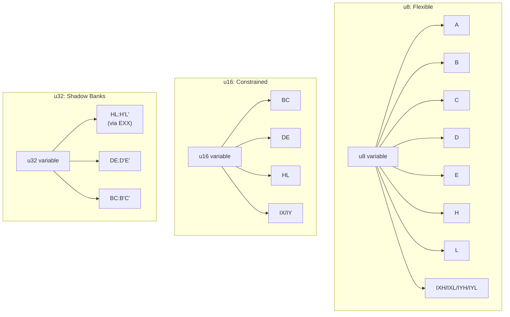

**u8 ADD:** 11 possible source registers → hundreds of valid assignments.
**u16 ADD:** only HL as accumulator → 2-3 valid assignments!
**4+ u16 variables → INFEASIBLE** without IX/IY (only 3 register pairs: BC, DE, HL).

Our enriched tables include width-aware scoring:
- `u16_pair_count`: how many u16 slots available
- `u16_add_natural`: 11T (HL+rr) vs `u16_add_via_u8`: 24T (decomposed)
- `u16_slots_free`: room for additional u16 variables

---

## 9. The CALL Save Problem

Function calls destroy registers. The caller must save live variables before CALL
and restore them after. This is often **the most expensive part of register allocation**.

### Save Strategies (cheapest first)

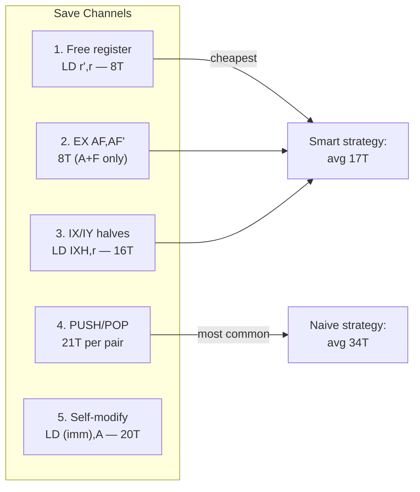

**Result:** Smart save strategy = 17T average (50% less than naive PUSH/POP).
On 500 functions × 2 CALLs = **17,000 T-states saved**.

---

## 10. Wave Function Collapse: The Next Frontier

**WFC (Wave Function Collapse)** is a constraint propagation technique from
procedural generation. Each instruction position starts with all possible
instructions, then constraints eliminate impossibilities.

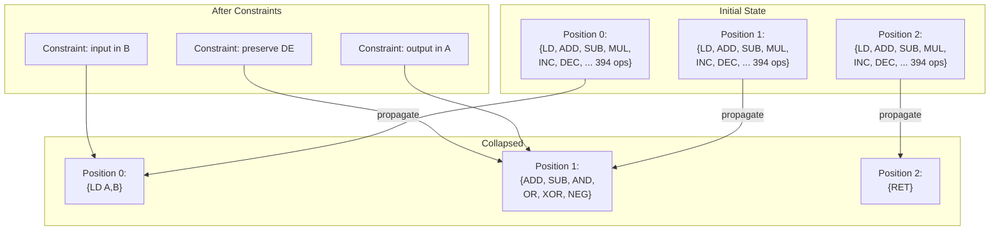

**GPU-friendly:** WFC reduces search space by 90-99% before brute force.
For GPU implementation: **reindexing** (regenerate thread-to-candidate mapping)
instead of runtime pruning (which causes warp divergence).

---

## 11. Real-World Data: What Z80 Code Actually Looks Like

We analyzed instruction frequencies across multiple real Z80 programs:

| Category | The Hobbit (1982) | ZX Demos | antique-toy book | Average |
|----------|------------------|----------|-----------------|---------|
| **LD/MOV** | 27% | 37% | 41% | **35%** |
| **ALU** | 19% | 25% | 20% | **22%** |
| **Branch** | 27% | 19% | 24% | **22%** |
| **Stack** | 8% | 10% | 4% | **7%** |
| **IX/IY** | 11% | 3% | 9% | **6%** |
| **Exchange** | 1% | 2% | 0.3% | **1%** |

**Key insight:** LD/MOV = 35% of all instructions. This is the overhead that
register allocation directly eliminates. A perfect allocator removes most of
these moves, saving ~30% of total execution time.

**IX/IY usage:** 6-11% in real code — higher than expected. IX/IY are used for:
- Structure field access: `LD A,(IX+offset)`
- Cross-bank bridge (not swapped by EXX)
- Cheap save slot: `LD IXH,r` (8T, no stack)

**EXX/EX < 1%:** Shadow registers rarely appear explicitly, but when they do,
they serve as context switches for 32-bit arithmetic or interrupt handlers.

---

## 12. What This Enables

### For the MinZ Compiler

```mermaid
flowchart LR
    N[Nanz source] --> MIR[MIR2 IR]
    MIR --> LV[Liveness Analysis]
    LV --> SIG[Compute Signature<br/>shape + op_bag]
    SIG --> LOOKUP[(Enriched Table<br/>37.6M entries)]
    LOOKUP --> |O(1)| ASN[Optimal Assignment]
    ASN --> CG[Code Generation]
    CG --> Z80[Z80 Binary]

    style LOOKUP fill:#66ff66
```

- **O(1) register allocation** for 90% of functions
- **Early infeasibility detection** — know BEFORE codegen if decomposition needed
- **Width-aware** — u8/u16/u32 constraints pre-computed
- **Idiom compatibility** — which mul8/div8 sequences work without save/restore
- **CALL overhead** — pre-computed save cost with smart channel selection

### For the Research Community

- **37.6M data points** on register allocation feasibility
- **Phase transition** at 6-7 variables — first empirical measurement at this scale
- **Operation-aware enrichment** — new approach to combining graph coloring with instruction selection
- **Proof: Z flag is write-only** — no branchless Z→CY conversion exists on Z80

### For Retro Computing

- **Branchless primitives:** ABS (6i,24T), MIN/MAX (8i,32T), CMOV (6i,24T)
- **Exact divisions:** div3 = A×171>>9 (no lookup table!)
- **LUT generators:** gray_decode EXACT in 13 instructions (replaces 256-byte table)
- **Bool convention:** CY flag + 0xFF/0x00 representation = optimal for Z80

---

## Appendix: The SBC A,A Trick

The single most important Z80 idiom for branchless programming:

```z80
SBC A, A    ; A = CY ? 0xFF : 0x00 (1 instruction, 4T)
            ; CY flag is PRESERVED after this instruction!
```

This creates a **bitmask from carry flag**, enabling:

| Pattern | Code | Cost |
|---------|------|------|
| CY→mask | `SBC A,A` | 1i, 4T |
| CY?B:0 | `SBC A,A; AND B` | 2i, 8T |
| CY?B:C (CMOV) | `SBC A,A; LD D,A; LD A,B; XOR C; AND D; XOR C` | 6i, 24T |
| ABS(A) | `LD B,A; RLCA; SBC A,A; LD C,A; XOR B; SUB C` | 6i, 24T |

All verified exhaustively on 256 (or 65536 for 2-input) test values.

---

*Generated from z80-optimizer project data. 83.6M shapes enumerated,
37.6M enriched with 15 operation-aware metrics. Tables available at
[github.com/oisee/z80-optimizer](https://github.com/oisee/z80-optimizer).*
