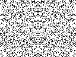
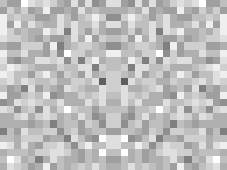
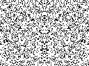
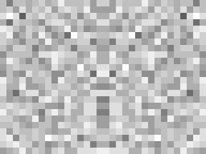
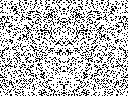
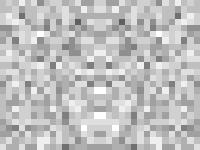

# pRNG-Generated Images

Z80 pRNG seeds → 128×96 monochrome → mirrored (OR horizontal flip) → grayscale via 4×4 block averaging.

CNN fitness: MobileNetV2 (ImageNet) classifies each generated image. We search for seeds where the "random" output resembles recognizable objects.

## Images

### Seed 0x5CF45186D99C20C8 — "Chain Mail"

CNN top prediction: **chain mail (7%)**, komondor (3%), fire screen (2.5%)

| Monochrome (128×96) | Grayscale (32×24, upscaled) |
|---|---|
|  |  |

### Seed 0xDEADBEEFCAFEBABE

| Monochrome | Grayscale |
|---|---|
|  |  |

### Seed 0x1234567890ABCDEF — Control

| Monochrome | Grayscale |
|---|---|
|  |  |

## How It Works

```
Seed (8 bytes)
  → Patrik Rak CMWC pRNG (×253, 10-byte state, period ~2^66)
  → 1536 bytes (128×96 mono, 1 bit/pixel)
  → OR with horizontal flip (symmetry)
  → 4×4 block average → 32×24 grayscale
  → Resize to 224×224 → MobileNetV2 → P(target class)
```

### Symmetry trick

Mirroring via OR: generate full noise, flip horizontally, OR together.
Result: irregular but symmetric — faces, butterflies, masks emerge from noise.

### Two-stage evaluation

1. **Quick filter** (no CNN): check contrast, structure, center-edge difference
2. **MobileNetV2** (GPU): ImageNet classification on grayscale

### GPU performance

- Exhaustive 4-byte seed: 4.3B seeds in ~2 minutes
- Hill climbing 8-byte seed: 1B evaluations in ~30 seconds
- Population 2000 × 500 generations overnight search

## pRNG: Patrik Rak CMWC

Same generator used in:
- Hole #17 enigma (256b intro, .ded^RMDA, LoveByte 2021)
- BB / Big Brother (256b intro, Introspec)

```python
def cmwc_next(state):
    state.idx = (state.idx + 1) & 7
    y = state.table[state.idx]
    t = y * 253 + state.carry      # multiply-with-carry
    state.carry = t >> 8
    x = ~(t & 0xFF) & 0xFF         # complement
    state.table[state.idx] = x
    return x
```

## Tools

- `cuda/prng_cat_search.py` — CNN-guided search (Python + PyTorch + CUDA)
- `cuda/z80_image_search.cu` — Pure CUDA brute-force (Hamming + edge metrics)
- `cuda/z80_prng_search.cu` — Generic pRNG seed search with multiple modes
