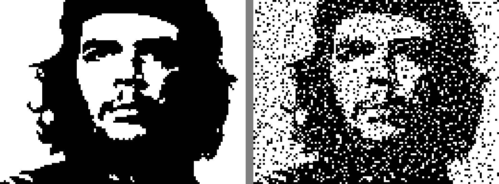
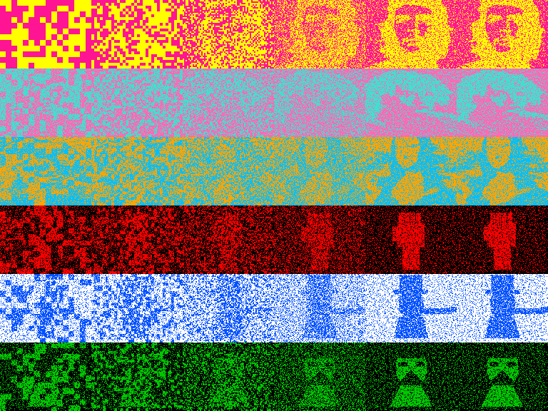
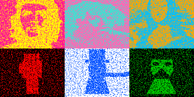

# pRNG Image Search — GPU Brute-Force for ZX Spectrum Intros

Finding recognizable images from minimal data using LFSR seeds + GPU brute-force.
75 experiments, 6 methods, 4 iconic faces, Warhol pop-art, XOR morphing.

## Quick Links

| What | Where |
|------|-------|
| **Foveal Gallery** (face-aware, scaling, Warhol) | [foveal_gallery/](foveal_gallery/README.md) |
| **XOR Morphing Chain** (6 faces, animated GIF) | [morph_chain/](morph_chain/) |
| **Foveal Strategies** (golden/mondrian/hybrid) | [foveal_README.md](foveal_README.md) |
| **Color Strategies** (ZX Spectrum attributes) | [foveal_color/](foveal_color/) |
| **Pop-Art / Warhol** (Marilyn, Che, all faces) | [foveal_marilyn_popart/](foveal_marilyn_popart/) |
| **Target images** | [targets/](targets/) |

---

## Hall of Fame

### Best Results per Method

| Cat (4.9%, 128B) | Che (15%, 1194B) | Einstein (15.3%) | Marilyn (14.9%) | Mona Lisa (15.2%) |
|---|---|---|---|---|
|  |  |  |  |  |
| Dual-layer evo | Segmented LFSR | Quadtree | Quadtree | Quadtree |

### Warhol Pop-Art

| Che | Marilyn | Mona Lisa | Einstein |
|---|---|---|---|
|  |  |  |  |

### XOR Morphing (cumulative chain)

Che → Einstein → Mona Lisa → Fist → Uncle Sam → Masked



6×6 grid: each row = one target emerging from the previous (L0→L5).



### Face-Aware Scaling 1×→4×

| 1× (48B) | 2× (126B) | 3× (252B) | 4× (426B) |
|---|---|---|---|
|  |  |  |  |
| 37.5% | 32.0% | 28.8% | **26.5%** |

Full scaling gallery with all faces: **[foveal_gallery/README.md](foveal_gallery/README.md)**

---

## Six Methods

### 1. Dual-Layer Evolutionary (best for simple targets)

5-layer architecture: 3 additive (OR) + 2 subtractive (AND NOT). Island model, CUDA.

- Kernel: `cuda/prng_hybrid_gpu.cu`
- ~500K img/s on RTX 4060 Ti
- Best: cat 4.9%, skull 14.7%

### 2. Segmented Hierarchical LFSR (best for photos)

Image split into progressive rectangles, each brute-forced (65536 seeds). XOR correction.

- Kernel: `cuda/prng_segmented_search.cu`
- 85-597 seeds in <1 second
- Best: Che 15.0%, all faces ~19%

### 3. Face-Aware Foveal (best quality/size ratio)

Attention-weighted regions: dense on eyes/nose/mouth, sparse on background.

- Same kernel with `--mode face` / `--mode facefile`
- 24-213 seeds (48-426 bytes)
- Scales linearly: ~5% improvement per 2× seeds

### 4. Introspec BB Port (demoscene-proven)

24-bit Galois LFSR, 66 layers, 2×2 XOR plots. CUDA port of BB (1st Multimatograf 2014).

- Kernel: `cuda/bb_search.cu`
- 4 minutes per full s0 sweep

### 5. Warhol Pop-Art Color

ZX Spectrum 8×8 attribute cells, 5 coloring strategies (zero extra bytes):

| Mono | Density | Face-region | Warm/cool | Pop-art |
|---|---|---|---|---|
|  |  |  |  |  |

### 6. XOR Morphing Chain (NEW)

Cumulative brute-force: each target searched ON TOP of previous canvas.
Seeds correct the delta → faces emerge and morph into each other.

- `--canvas prev.pgm` flag for chaining
- seed-3 → seed-2 → seed-1 → SEED trick for "static reveal" animation

---

## Results Summary

| Method | Target | Error | Data | Time |
|--------|--------|-------|------|------|
| Dual-layer evo | Cat | **4.9%** | 128B | 18s |
| Dual-layer evo | Skull | 14.7% | 128B | 18s |
| Segmented 6-level | Che | **15.0%** | 1194B | <1s |
| Quadtree | Marilyn (real) | **14.9%** | 1194B | 0.5s |
| Quadtree | Mona Lisa | **15.2%** | 1194B | 0.5s |
| Quadtree | Einstein | **15.3%** | 1194B | 0.5s |
| Face-aware 4× | Che | 26.5% | 426B | 0.5s |
| Face-aware 4× | Einstein | **24.1%** | 426B | 0.5s |
| Face-aware 1× | Che | 37.5% | 48B | 0.1s |
| Mondrian | Che | 33.3% | 32B | 0.1s |
| Morph chain ×6 | 6 faces | ~19% each | 7164B total | 3s |

## All Experiment Directories

### Dual-Layer Evolutionary
| Directory | Target | Notes |
|-----------|--------|-------|
| [dual_cat_long/](dual_cat_long/) | cat | **best cat**, f=0.049 |
| [dual_skull_long/](dual_skull_long/) | skull | **best skull**, f=0.147 |
| [dual_einstein_v3/](dual_einstein_v3/) | einstein | aggressive restart, f=0.151 |
| [dual_einstein_v4/](dual_einstein_v4/) | einstein | subtractive layers |

### Segmented / Quadtree
| Directory | Target | Notes |
|-----------|--------|-------|
| [segmented_che_v2/](segmented_che_v2/) | che | **6 levels, 15%** |
| [segmented_che/](segmented_che/) | che | 4 levels, 31% |

### Face-Aware Foveal (NEW)
| Directory | Target | Notes |
|-----------|--------|-------|
| [foveal_gallery/](foveal_gallery/README.md) | **all 4 faces** | **scaling 1×-4×, Warhol, progressive layers** |
| [foveal_mondrian_s42/](foveal_mondrian_s42/) | che | mondrian random, 33% on 32B |
| [foveal_color/](foveal_color/) | che | 5 ZX color strategies |
| [foveal_marilyn_popart/](foveal_marilyn_popart/) | all | Warhol grids, per-cell palette |

### XOR Morphing (NEW)
| Directory | Notes |
|-----------|-------|
| [morph_chain/](morph_chain/) | **6-face cumulative chain, animated GIF** |
| [morph_demo/](morph_demo/) | earlier non-cumulative experiment |

### Introspec BB Port
| Directory | Target | Notes |
|-----------|--------|-------|
| [bb_putin_p4_full/](bb_putin_p4_full/) | putin | original target, p=4 |
| [bb_che_p4/](bb_che_p4/) | che | p=4, full 256 s0 |

### Layered LFSR
| Directory | Target | Notes |
|-----------|--------|-------|
| [layered_che_128/](layered_che_128/) | che | 128 layers, 25.6% |
| [layered_einstein/](layered_einstein/) | einstein | 128 layers, 26.0% |

## Targets

Available in [targets/](targets/):

Che Guevara, Einstein (real photo), Marilyn Monroe (real photo, 1953), Mona Lisa,
raised fist, Uncle Sam, masked protester, worker, megaphone, cat, skull (synthetic).

## Build

```bash
nvcc -O3 -o cuda/prng_segmented_search cuda/prng_segmented_search.cu
./cuda/prng_segmented_search --target targets/che.pgm --mode quadtree --density 3 --output result/
./cuda/prng_segmented_search --target targets/che.pgm --mode face --output face_result/
./cuda/prng_segmented_search --target targets/einstein.pgm --canvas prev/canvas.pgm --mode quadtree --output morph/
```

---

## Convert Your Video → AND-cascade Animation

Turn any MP4 into a playable LFSR-16 animation for `docs/renderer.html`.

**Requirements:** CUDA GPU + `nvcc` + `ffmpeg` + `python3 opencv-python`

### Build once

```bash
nvcc -O3 -o cuda/prng_budget_search cuda/prng_budget_search.cu -lm
```

### Quick encode

```bash
python3 cuda/encode_anim.py \
  --input /path/to/video.mp4 \
  --out data/my_anim.json \
  --budget 256 --kf-budget 512 \
  --every 3 \
  --name "My video"
```

Play: open `docs/renderer.html`, click the preset or drag-drop `my_anim.json`.

### What content works best

| Works great | Struggles |
|-------------|-----------|
| Sparse bright on black (fire, stars, lines) | Dense full-frame content (Bad Apple) |
| Slow/subtle motion — portraits, faces | Fast cuts, camera shake |
| High-contrast silhouettes | Grayscale gradients |
| <10% pixels lit per frame | >30% pixels lit per frame |

### Key parameters

| Flag | Default | Use when |
|------|---------|----------|
| `--budget N` | 128 | Seeds per delta frame. 64=fast/lossy, 256=good, 600=near-perfect |
| `--kf-budget N` | 2×budget | Seeds for keyframe (first frame or after reset) |
| `--every N` | 5 | Take every Nth source frame. 2=smooth, 6=choppy but fast |
| `--kf-every N` | 0 (off) | Insert keyframe every N frames — prevents error drift on long videos |
| `--kf-error X` | 0 (off) | Insert keyframe when delta error exceeds X% (e.g. `20.0`). Don't combine with `--kf-every` on dense content — can cascade |
| `--weighted` | off | Face/edge priority via OpenCV heatmap. Helps at budget ≤128 |
| `--gpu N` | 0 | GPU device index |

### Typical recipes

```bash
# Living portrait (face video, 5-30s, best quality)
python3 cuda/encode_anim.py --input face.mp4 --out data/portrait.json \
  --budget 512 --kf-budget 1024 --every 2 --weighted

# Short loop (15-60s, balanced)
python3 cuda/encode_anim.py --input clip.mp4 --out data/clip.json \
  --budget 256 --kf-budget 512 --every 3 --kf-every 60

# Long video (>1 min, streaming quality)
python3 cuda/encode_anim.py --input long.mp4 --out data/long.json \
  --budget 64 --kf-budget 256 --every 6 --kf-every 100
```

### Encoding speed

~2–4 seconds per frame on RTX 4060 Ti (independent of `--budget`).
100 frames ≈ 4 min · 500 frames ≈ 20 min · 1643 frames ≈ 60 min

---

## Carrier-Payload (CP) Delta Encoding

For streaming animations where seed budget is precious:

- **CP mode**: 1 carrier seed per frame (blk=8) maps error zones to OR-mask → **3× fewer seeds** vs naive delta
- **Carrier catalog** (`data/carrier_catalog.bin`, 9.4MB): 65536 precomputed bitmaps, built in 236ms, queried at 2ms/frame
- **ZX Spectrum tape math**: CP = 16 bytes/frame → 0.1s/frame — the only viable real-time path
- Pass `--cp` to `encode_anim.py`; enable CP preset in `docs/renderer.html`

Demos available: Ёжик в тумане 104fr, Che portrait 63fr, plain/weighted/CP comparison sets.

## Heatmap-Weighted Search

Focus pixel budget on the visually important regions (face, eyes, edges):

```bash
python3 cuda/make_heatmap.py --input target.pgm --output target.wmap  # OpenCV Haar + edge detection
./cuda/prng_budget_search --target target.pgm --weight-map target.wmap --budget 64 --output result/
```

- At `--budget 64`: face zone error 21.94% → 11.54% (**47% reduction**), total cost +5.76%
- Sweet spot: budget 64–128 seeds/frame for low-bitrate streaming
- At large budget (≥600): canonical already near-perfect everywhere — heatmap doesn't help

## Inspired By

- **Introspec** — [BB](https://www.pouet.net/prod.php?which=63074) ZX 256b, 1st Multimatograf 2014
- **Ilmenit** — [Mona](https://www.pouet.net/prod.php?which=62917) Atari 256b, LFSR brush strokes
