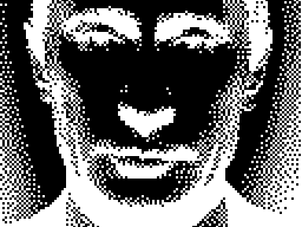
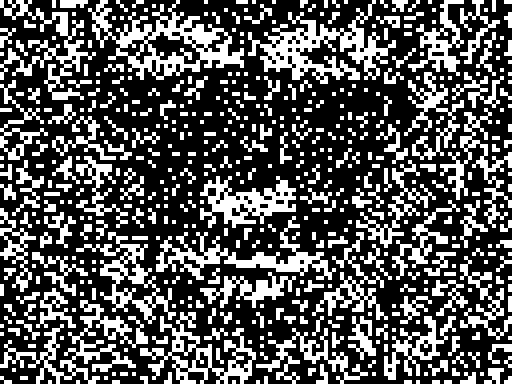
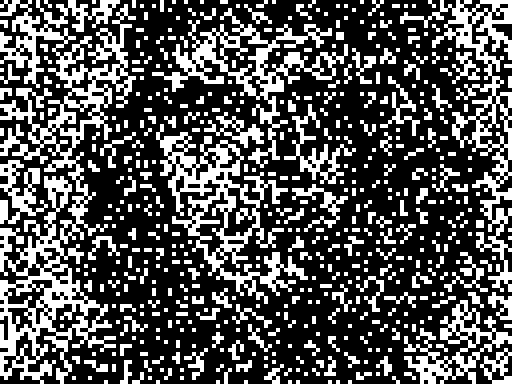
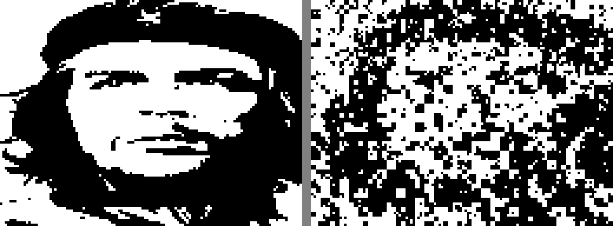
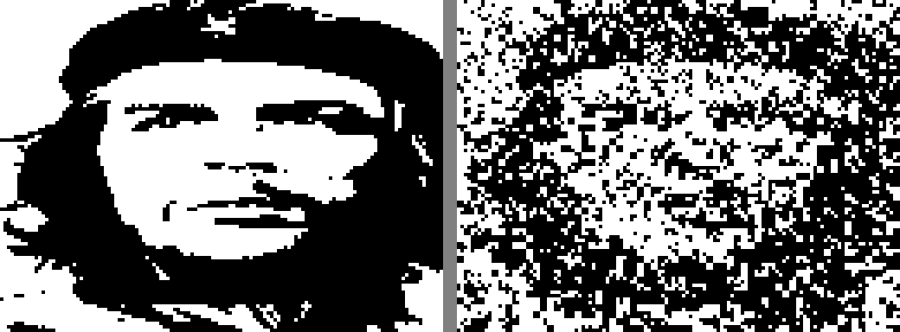
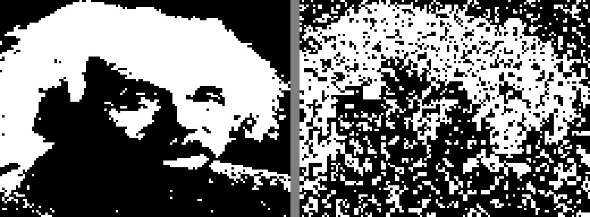

# pRNG Image Search — GPU Evolutionary & LFSR Brute-Force

Finding recognizable images from minimal generators for ZX Spectrum 256-byte intros.
Three approaches: evolutionary (dual-layer), hierarchical LFSR, and Introspec's BB algorithm.

## Hall of Fame

### Synthetic Targets (Dual-Layer Evolutionary, CUDA)

| Cat (f=0.049, 128B) | Skull (f=0.147, 128B) |
|---|---|
|  |  |

### Real Photos (Segmented Hierarchical LFSR)

| Che Guevara 4 levels (31%, 170B) | Che 6 levels (15%, 1194B) |
|---|---|
|  |  |

### Introspec's BB Algorithm (CUDA Port)

| Putin target (original) | Putin result (p=4, s0=2) | Che result (p=4, s0=3) |
|---|---|---|
|  |  |  |

### Einstein Experiments (Dual-Layer + Subtractive)

| Synthetic (f=0.049) | Real photo, v3 (f=0.151) | Real photo, v4 subtractive (f=0.242) |
|---|---|---|
|  |  |  |

### Layered LFSR (Mona/BB Style)

| Che 64 layers (27%, 128B) | Che 128 layers (26%, 256B) | Einstein 128 layers (26%, 256B) |
|---|---|---|
|  |  |  |

## Evolution Mosaics

| Cat (5000 gens) | Skull (5000 gens) |
|---|---|
|  |  |

## Three Approaches Compared

### 1. Dual-Layer Evolutionary (best for simple targets)

5-layer architecture: 3 additive (OR) + 2 subtractive (AND NOT), independent symmetries per layer. Island model with migration and stall restart.

```
Layer A ── H-mirror, additive ──── head shape, hair, outline
Layer B ── no-sym, additive ────── asymmetric features
Layer C ── no-sym, additive ────── fine detail
Layer D ── H-mirror, SUBTRACTIVE ─ carves eyes, nose, mouth
Layer E ── no-sym, SUBTRACTIVE ─── asymmetric cuts

Result = (A | B | C | shapes) AND NOT (D | E) → threshold → binary
```

- Kernel: `cuda/prng_hybrid_gpu.cu`
- Speed: ~500K images/sec on RTX 4060 Ti
- Best for synthetic targets (cat, skull) where shape is simple

### 2. Hierarchical Segmented LFSR (best for real photos)

Image split into progressively smaller rectangles, each brute-forced independently (65536 LFSR seed candidates per segment). XOR correction between levels.

```
Level 0:    1 seed  × whole 128x96  @ 8x8 blocks    (2 bytes)
Level 1:    4 seeds × quadrants     @ 4x4 blocks    (8 bytes)
Level 2:   16 seeds × 32x24 tiles   @ 2x2 blocks   (32 bytes)
Level 3:   64 seeds × 16x12 tiles   @ 1x1 pixels  (128 bytes)
Level 4+: 256+ seeds × 8x6 tiles    @ 1x1 pixels  (512+ bytes)
```

- Kernel: `cuda/prng_segmented_search.cu`
- Speed: 85 seeds in <1 second
- **Guaranteed convergence**: each level can only reduce error

### 3. Introspec's BB Algorithm (demoscene-proven)

CUDA port of the exact algorithm from BB (Big Brother) by Introspec, 1st place Multimatograf 2014.

- 24-bit Galois LFSR (polynomial 0xDB), NOT 32-bit
- 2×2 pixel XOR plots on ZX Spectrum screen (256×192)
- 66 layers, layer N draws N×P random points (decreasing)
- 3 weighted masks for fitness (face=4×, background=1×)
- High byte of LFSR carries between layers (not reset)
- Original: days on 7 CPU cores. Our GPU port: **4 minutes per full s0 sweep**

- Kernel: `cuda/bb_search.cu`
- Source: Introspec's `bb_brute_search_2.zip` (April 2014)

## Targets

| Cat | Skull | Che Guevara | Einstein | Putin (Introspec) |
|---|---|---|---|---|
| synthetic | synthetic | [real photo](targets/che_preview.png) | [real photo](targets/einstein_real_preview.png) | [dithered .scr](bb_putin/target_2x.png) |

## Results Summary

| Method | Target | Error | Data | Time | Visual |
|--------|--------|-------|------|------|--------|
| Dual-layer evo | Cat | **4.9%** | 128B | 18s | excellent |
| Dual-layer evo | Skull | 14.7% | 128B | 18s | good |
| Dual-layer+sub | Einstein synth | 5.9% | 128B | 4s | good |
| Dual-layer+sub | Einstein real v3 | 15.1% | 128B | 5min | recognizable |
| Segmented 6-level | Che real | **15.0%** | 1194B | <1s | good |
| Segmented 4-level | Che real | 31.2% | 170B | <1s | recognizable |
| Layered 128 | Che real | 25.6% | 256B | 0.7s | noisy but visible |
| Layered 128 | Einstein real | 26.0% | 256B | 0.7s | noisy but visible |
| BB port p=4 | Putin .scr | ~25% | 132B | 4min | noisy, face hints |
| BB port p=4 | Che real | ~25% | 132B | 4min | noisy, shape visible |

## All Experiments

### Dual-Layer Evolutionary
| Directory | Target | Notes |
|-----------|--------|-------|
| [dual_cat_long/](dual_cat_long/) | cat | **best cat**, 5000g, f=0.049 |
| [dual_skull_long/](dual_skull_long/) | skull | **best skull**, 5000g, f=0.147 |
| [dual_einstein_v4/](dual_einstein_v4/) | einstein synth | subtractive, eyes visible |
| [dual_einstein_v3/](dual_einstein_v3/) | einstein synth | aggressive restart, f=0.151 |
| [dual_einstein_real/](dual_einstein_real/) | einstein photo | 1000g only |
| [dual_che/](dual_che/) | che photo | 1000g only |
| [hybrid_dual_cat/](hybrid_dual_cat/) | cat | first dual proof |
| [hybrid_gpu/](hybrid_gpu/) | cat | single-layer baseline |
| [hybrid_gpu_skull/](hybrid_gpu_skull/) | skull | single-layer baseline |

### Segmented Hierarchical LFSR
| Directory | Target | Notes |
|-----------|--------|-------|
| [segmented_che_v2/](segmented_che_v2/) | che | **6 levels, 15% error** |
| [segmented_che/](segmented_che/) | che | 4 levels, 31% error |

### Layered LFSR (Mona/BB Style)
| Directory | Target | Notes |
|-----------|--------|-------|
| [layered_che_128/](layered_che_128/) | che | 128 layers, 25.6% |
| [layered_einstein/](layered_einstein/) | einstein | 128 layers, 26.0% |
| [layered_che_v2/](layered_che_v2/) | che | 64 layers, first working |

### Introspec BB Algorithm (CUDA Port)
| Directory | Target | Notes |
|-----------|--------|-------|
| [bb_putin_p4_full/](bb_putin_p4_full/) | putin | **original target + masks**, p=4 |
| [bb_che_p4/](bb_che_p4/) | che | p=4, full 256 s0 |
| [bb_putin/](bb_putin/) | putin | p=2, first test |

### Seed-Only CNN Search (Day 3-4, superseded)
| Directory | Target | Notes |
|-----------|--------|-------|
| [cat/](cat/) | cat | MobileNetV2, 1.7% |
| [maze/](maze/) | maze | MobileNetV2 |
| [dithered/](dithered/) | various | VGG perceptual loss |

## Hardware

- **GPU0**: RTX 4060 Ti 16GB — primary search
- **GPU1**: RTX 4060 Ti 16GB — parallel / different targets
- Speed: 500K-950K img/s (evolutionary), 0.9s/layer (BB port)

## Inspired By

- **Introspec** — [BB (Big Brother)](https://www.pouet.net/prod.php?which=63074) ZX Spectrum 256b, 1st Multimatograf 2014. Source code analyzed and ported to CUDA.
- **Ilmenit** — [Mona](https://www.pouet.net/prod.php?which=62917) Atari 256b. 64 LFSR brush strokes, offline brute-force.
- **.ded^RMDA (Maxim Muchkaev)** — Hole #17, CALL-chain rendering technique.
