# pRNG Image Search Gallery

Z80 pRNG seeds that generate recognizable patterns from pure noise.
Each image = 8-byte SEED → Patrik Rak CMWC pRNG → 128×96 mono → OR horizontal flip → grayscale.

## Pipeline
```
SEED (8 bytes)
  → CMWC pRNG (×253, period ~2^66)
  → 1536 bytes (128×96 mono, 1 bit/pixel)
  → OR with horizontal flip (vertical symmetry)
  → 4×4 block average → 32×24 grayscale
  → MobileNetV2 (ImageNet) → class probability
```

## Search Methods
- **Exhaustive**: 4-byte seed, 4.3B candidates, ~2 min on RTX 4060 Ti
- **Hill climbing**: 8-byte seed, 1500 population × 300 generations × mutations
- **Multi-target**: 7 ImageNet classes searched simultaneously
- **Top-10**: best 10 seeds kept per target class

## Leaderboard (all targets, sorted by CNN score)

| Rank | Score | Target | Seed | Mono | Grayscale |
|------|-------|--------|------|------|-----------|
| 1 | 0.0172 | cat | `0x7776B0B492A3C25E` |  |  |
| 2 | 0.0172 | cat | `0x7776B0B492A3C25E` | 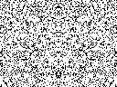 |  |
| 3 | 0.0172 | cat | `0x7776B0B492A3C25E` |  |  |
| 4 | 0.0172 | cat | `0x7776B0B492A3C25E` |  |  |
| 5 | 0.0172 | cat | `0x7776B0B492A3C25E` |  |  |
| 6 | 0.0172 | cat | `0x7776B0B492A3C25E` |  | 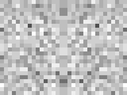 |
| 7 | 0.0172 | cat | `0x7776B0B492A3C25E` |  |  |
| 8 | 0.0172 | cat | `0x7776B0B492A3C25E` |  |  |
| 9 | 0.0172 | cat | `0x7776B0B492A3C25E` |  |  |
| 10 | 0.0172 | cat | `0x7776B0B492A3C25E` |  |  |
| 11 | 0.0171 | maze | `0xB21E93F1CC4B8BC9` |  |  |
| 12 | 0.0171 | maze | `0xB21E93F1CC4B8BC9` |  |  |
| 13 | 0.0171 | maze | `0xB21E93F1CC4B8BC9` |  |  |
| 14 | 0.0171 | maze | `0xB21E93F1CC4B8BC9` | 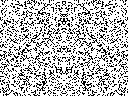 |  |
| 15 | 0.0171 | maze | `0xB21E93F1CC4B8BC9` |  |  |
| 16 | 0.0171 | maze | `0xB21E93F1CC4B8BC9` |  |  |
| 17 | 0.0171 | maze | `0xB21E93F1CC4B8BC9` |  |  |
| 18 | 0.0171 | maze | `0xB21E93F1CC4B8BC9` |  |  |
| 19 | 0.0171 | maze | `0xB21E93F1CC4B8BC9` |  |  |
| 20 | 0.0171 | maze | `0xB21E93F1CC4B8BC9` |  |  |
| 21 | 0.0077 | mask | `0x1297C68AA981FB60` |  |  |
| 22 | 0.0077 | mask | `0x1297C68AA981FB60` |  |  |
| 23 | 0.0077 | mask | `0x1297C68AA981FB60` |  |  |
| 24 | 0.0077 | mask | `0x1297C68AA981FB60` |  |  |
| 25 | 0.0077 | mask | `0x1297C68AA981FB60` | 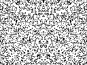 |  |
| 26 | 0.0077 | mask | `0x1297C68AA981FB60` |  | 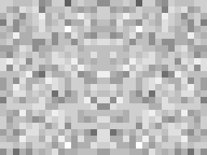 |
| 27 | 0.0077 | mask | `0x1297C68AA981FB60` |  |  |
| 28 | 0.0077 | mask | `0x1297C68AA981FB60` |  |  |
| 29 | 0.0077 | mask | `0x1297C68AA981FB60` |  |  |
| 30 | 0.0077 | mask | `0x1297C68AA981FB60` |  |  |

## Cat

Best score: 0.0172

| Rank | Score | Seed | Mono | Grayscale |
|------|-------|------|------|-----------|
| 1 | 0.0172 | `0x7776B0B492A3C25E` |  |  |
| 2 | 0.0172 | `0x7776B0B492A3C25E` |  |  |
| 3 | 0.0172 | `0x7776B0B492A3C25E` |  |  |
| 4 | 0.0172 | `0x7776B0B492A3C25E` |  |  |
| 5 | 0.0172 | `0x7776B0B492A3C25E` |  |  |
| 6 | 0.0172 | `0x7776B0B492A3C25E` |  |  |
| 7 | 0.0172 | `0x7776B0B492A3C25E` |  |  |
| 8 | 0.0172 | `0x7776B0B492A3C25E` |  |  |
| 9 | 0.0172 | `0x7776B0B492A3C25E` |  |  |
| 10 | 0.0172 | `0x7776B0B492A3C25E` |  |  |

## Maze

Best score: 0.0171

| Rank | Score | Seed | Mono | Grayscale |
|------|-------|------|------|-----------|
| 1 | 0.0171 | `0xB21E93F1CC4B8BC9` |  |  |
| 2 | 0.0171 | `0xB21E93F1CC4B8BC9` |  |  |
| 3 | 0.0171 | `0xB21E93F1CC4B8BC9` |  |  |
| 4 | 0.0171 | `0xB21E93F1CC4B8BC9` |  |  |
| 5 | 0.0171 | `0xB21E93F1CC4B8BC9` |  |  |
| 6 | 0.0171 | `0xB21E93F1CC4B8BC9` |  |  |
| 7 | 0.0171 | `0xB21E93F1CC4B8BC9` |  |  |
| 8 | 0.0171 | `0xB21E93F1CC4B8BC9` |  |  |
| 9 | 0.0171 | `0xB21E93F1CC4B8BC9` |  |  |
| 10 | 0.0171 | `0xB21E93F1CC4B8BC9` |  |  |

## Mask

Best score: 0.0077

| Rank | Score | Seed | Mono | Grayscale |
|------|-------|------|------|-----------|
| 1 | 0.0077 | `0x1297C68AA981FB60` |  |  |
| 2 | 0.0077 | `0x1297C68AA981FB60` |  |  |
| 3 | 0.0077 | `0x1297C68AA981FB60` |  |  |
| 4 | 0.0077 | `0x1297C68AA981FB60` |  |  |
| 5 | 0.0077 | `0x1297C68AA981FB60` |  |  |
| 6 | 0.0077 | `0x1297C68AA981FB60` |  |  |
| 7 | 0.0077 | `0x1297C68AA981FB60` |  |  |
| 8 | 0.0077 | `0x1297C68AA981FB60` |  |  |
| 9 | 0.0077 | `0x1297C68AA981FB60` |  |  |
| 10 | 0.0077 | `0x1297C68AA981FB60` |  |  |

## Butterfly

Best score: 0.0032

| Rank | Score | Seed | Mono | Grayscale |
|------|-------|------|------|-----------|
| 1 | 0.0032 | `0x2E327A5B1E28ED96` |  |  |
| 2 | 0.0032 | `0x2E327A5B1E28ED96` |  |  |
| 3 | 0.0032 | `0x2E327A5B1E28ED96` |  |  |
| 4 | 0.0032 | `0x2E327A5B1E28ED96` |  | 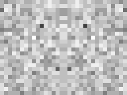 |
| 5 | 0.0032 | `0x2E327A5B1E28ED96` |  |  |
| 6 | 0.0032 | `0x2E327A5B1E28ED96` |  |  |
| 7 | 0.0032 | `0x2E327A5B1E28ED96` |  |  |
| 8 | 0.0032 | `0x2E327A5B1E28ED96` | 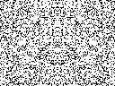 |  |
| 9 | 0.0032 | `0x2E327A5B1E28ED96` |  |  |
| 10 | 0.0032 | `0x2E327A5B1E28ED96` |  |  |

## Spider_Web

Best score: 0.0025

| Rank | Score | Seed | Mono | Grayscale |
|------|-------|------|------|-----------|
| 1 | 0.0025 | `0x6DF2B5E4D04A8B8B` |  |  |
| 2 | 0.0025 | `0x6DF2B5E4D04A8B8B` |  |  |
| 3 | 0.0025 | `0x6DF2B5E4D04A8B8B` |  |  |
| 4 | 0.0025 | `0x6DF2B5E4D04A8B8B` |  |  |
| 5 | 0.0025 | `0x6DF2B5E4D04A8B8B` |  |  |
| 6 | 0.0025 | `0x6DF2B5E4D04A8B8B` |  |  |
| 7 | 0.0025 | `0x6DF2B5E4D04A8B8B` |  |  |
| 8 | 0.0025 | `0x6DF2B5E4D04A8B8B` |  |  |
| 9 | 0.0025 | `0x6DF2B5E4D04A8B8B` | 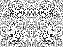 |  |
| 10 | 0.0025 | `0x6DF2B5E4D04A8B8B` |  | 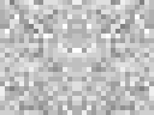 |

## Starfish

Best score: 0.0010

| Rank | Score | Seed | Mono | Grayscale |
|------|-------|------|------|-----------|
| 1 | 0.0010 | `0x5CC19777153A41FD` |  |  |
| 2 | 0.0010 | `0x5CC19777153A41FD` |  |  |
| 3 | 0.0010 | `0x5CC19777153A41FD` |  |  |
| 4 | 0.0010 | `0x5CC19777153A41FD` | 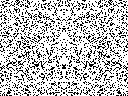 |  |
| 5 | 0.0010 | `0x5CC19777153A41FD` |  |  |
| 6 | 0.0010 | `0x5CC19777153A41FD` |  |  |
| 7 | 0.0010 | `0x5CC19777153A41FD` |  |  |
| 8 | 0.0010 | `0x5CC19777153A41FD` |  |  |
| 9 | 0.0010 | `0x5CC19777153A41FD` |  | 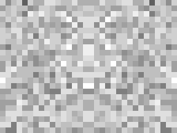 |
| 10 | 0.0010 | `0x5CC19777153A41FD` |  |  |

## Jellyfish

Best score: 0.0003

| Rank | Score | Seed | Mono | Grayscale |
|------|-------|------|------|-----------|
| 1 | 0.0003 | `0xC6CF1C693BB89CDE` |  |  |
| 2 | 0.0003 | `0xC6CF1C693BB89CDE` |  |  |
| 3 | 0.0003 | `0xC6CF1C693BB89CDE` |  |  |
| 4 | 0.0003 | `0xC6CF1C693BB89CDE` |  |  |
| 5 | 0.0003 | `0xC6CF1C693BB89CDE` |  |  |
| 6 | 0.0003 | `0xC6CF1C693BB89CDE` | 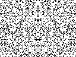 |  |
| 7 | 0.0003 | `0xC6CF1C693BB89CDE` |  |  |
| 8 | 0.0003 | `0xC6CF1C693BB89CDE` |  |  |
| 9 | 0.0003 | `0xC6CF1C693BB89CDE` |  |  |
| 10 | 0.0003 | `0xC6CF1C693BB89CDE` |  |  |

## Original Seeds (pre-search)

| Name | Seed | CNN Top-1 | Mono | Grayscale |
|------|------|-----------|------|-----------|
| chainmail | `0x5CF45186D99C20C8` | chain mail (7%) |  |  |
| deadbeef | `0xDEADBEEFCAFEBABE` | — |  |  |
| random1 | `0x1234567890ABCDEF` | — |  |  |

## Technical Notes

### Why scores are low (1-2%)
MobileNetV2 is trained on photos, not 1-bit noise patterns.
Even with symmetry, the patterns are abstract textures, not recognizable objects.
Better approaches (TODO):
1. **Dithered target**: convert photo → Floyd-Steinberg dither → find pRNG seed matching dithered image
2. **Feature matching**: compare VGG intermediate features (perceptual loss) instead of class probability
3. **Multi-scale symmetry**: mirror on 2+ axes, radial symmetry for more structure
4. **Guided generation**: use gradient of CNN loss to inform seed mutation direction

### Hardware
- GPU0 (RTX 4060 Ti 16GB): multi-target search
- GPU1 (RTX 4060 Ti 16GB): dedicated cat search (2000 pop × 500 gen)
- Total overnight: ~12 hours, ~10B seed evaluations

### Inspired by
- **Introspec** — BB (Big Brother) 256-byte ZX Spectrum intro
- **.ded^RMDA (Maxim Muchkaev)** — Hole #17 enigma, CALL-chain rendering
- **Mona** (Atari 256b) — the original 'draw with noise' concept

### Tools
- `cuda/prng_cat_search.py` — CNN-guided search (PyTorch + MobileNetV2)
- `cuda/z80_image_search.cu` — Pure CUDA brute-force
- `cuda/z80_prng_search.cu` — Generic pRNG seed search