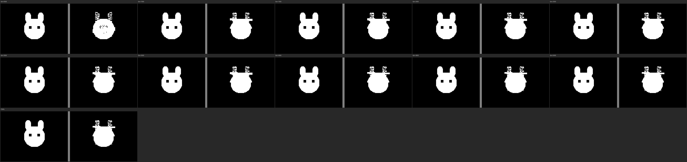
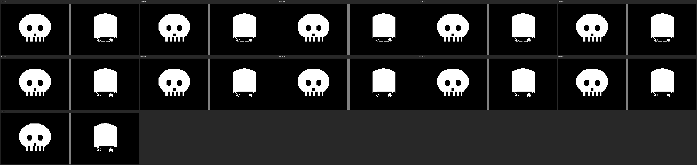

# pRNG Image Search — GPU Evolutionary Generator

Finding recognizable images from minimal generators on Z80 hardware.
128x96 mono (1536 bytes), target: fit in 256-byte ZX Spectrum intro.

## Best Results

### Dual-Layer Generator (CUDA, ~500K img/s)

5-layer architecture: 3 additive (OR) + 2 subtractive (AND NOT), independent symmetries.

| Target | Best | Result | Details |
|--------|------|--------|---------|
| Cat | f=0.049 |  | [evolution](dual_cat_long/) |
| Skull | f=0.147 |  | [evolution](dual_skull_long/) |
| Einstein | f=0.151 |  | [v3](dual_einstein_v3/), [v4 (subtractive)](dual_einstein_v4/) |

### Evolution Mosaics

| Cat (5000 gens) | Skull (5000 gens) |
|---|---|
|  |  |

## Architecture

```
Layer A ── H-mirror, additive ──────── head shape, hair, outline
Layer B ── no-sym, additive ─────────  asymmetric features, fill
Layer C ── no-sym, additive (sparse) ─ fine detail, texture
Layer D ── H-mirror, SUBTRACTIVE ────  carves eyes, nose, mouth
Layer E ── no-sym, SUBTRACTIVE ──────  asymmetric cuts, wrinkles

Result = (A | B | C | shapes) AND NOT (D | E) → regional threshold → binary
```

Each layer: independent pRNG seed (8 bytes) + density control + tile masks.
Basis shapes (circle, gradient, stripes) always H-mirrored.
Regional threshold: 2x3 grid with per-region density.

**Key insight**: faces need H-mirror (eyes symmetric) but NOT V-mirror (forehead != chin).
Subtractive layers carve dark features (eye sockets, mouth) from white mass.

## Search Methods

### Method 3: CUDA Dual-Layer Evolutionary (current best)

- `cuda/prng_hybrid_gpu.cu` — all-GPU generator + fitness
- Population: 4096-8192 genomes, 16 islands with migration
- Fitness: MSE + edge similarity + block-level MSE (no neural network needed)
- Island model: ring migration every 30-50 gens, stall restart at 50-120 gens
- Speed: ~500K images/sec on RTX 4060 Ti
- `--dual` flag for 5-layer mode, `--synthetic cat/skull` or `--target file.pgm`

### Method 2: Python Hybrid Generator (slower predecessor)

- `cuda/prng_hybrid_search.py` — 57-byte genome, VGG16 perceptual loss
- ~10 img/sec (Python per-pixel loops), superseded by CUDA version

### Method 1: Seed-Only CNN Search (original, limited)

- `cuda/prng_cat_search.py` — MobileNetV2 classifier as fitness
- 8-byte seed → CMWC pRNG → 128x96 mono → OR H-flip → CNN score
- **Fundamental limit**: 10-byte state cannot encode 1536-byte image
- Best: chain_mail 7%, cat 1.7% — textures, not objects

## All Experiments

### Dual-Layer (CUDA)

| Directory | Target | Mode | Best | Notes |
|-----------|--------|------|------|-------|
| [dual_cat_long/](dual_cat_long/) | cat | dual, 5000g 8K pop | **0.049** | best cat |
| [dual_skull_long/](dual_skull_long/) | skull | dual, 5000g 8K pop | **0.147** | best skull |
| [dual_einstein_v4/](dual_einstein_v4/) | einstein | dual+sub, no V-mirror | 0.242 | eyes+mustache visible |
| [dual_einstein_v3/](dual_einstein_v3/) | einstein | dual+sub, aggressive restart | **0.151** | best einstein numerically |
| [dual_einstein_v2/](dual_einstein_v2/) | einstein | dual+sub, first test | 0.167 | |
| [hybrid_dual_cat/](hybrid_dual_cat/) | cat | dual, 500g quick | 0.059 | first dual proof |
| [hybrid_gpu/](hybrid_gpu/) | cat | single-layer baseline | 0.284 | superseded |
| [hybrid_gpu_skull/](hybrid_gpu_skull/) | skull | single-layer baseline | 0.345 | superseded |

### Seed-Only (Python+CNN)

| Directory | Target | Method | Score |
|-----------|--------|--------|-------|
| [cat/](cat/) | cat | MobileNetV2 | 1.7% |
| [maze/](maze/) | maze | MobileNetV2 | 1.7% |
| [mask/](mask/) | mask | MobileNetV2 | 0.8% |
| [butterfly/](butterfly/) | butterfly | MobileNetV2 | 0.3% |
| [spider_web/](spider_web/) | spider_web | MobileNetV2 | 0.3% |
| [starfish/](starfish/) | starfish | MobileNetV2 | 0.1% |
| [jellyfish/](jellyfish/) | jellyfish | MobileNetV2 | 0.03% |
| [dithered/](dithered/) | various | VGG perceptual | loss 25.3 |

### Targets

| Target | Preview |
|--------|---------|
| [targets/](targets/) | cat, skull, smiley, heart, star, tree, fish, einstein |

## Hardware

- **GPU0**: RTX 4060 Ti 16GB — primary search
- **GPU1**: RTX 4060 Ti 16GB — parallel search / different targets
- Speed: ~500K-950K img/s (dual-layer / single-layer)

## Inspired By

- **Introspec** — BB (Big Brother) 256-byte ZX Spectrum intro
- **.ded^RMDA (Maxim Muchkaev)** — Hole #17, CALL-chain rendering
- **Mona** (Atari 256b) — the original "draw with noise" concept
