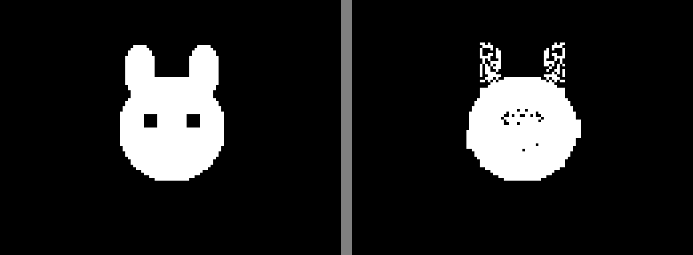
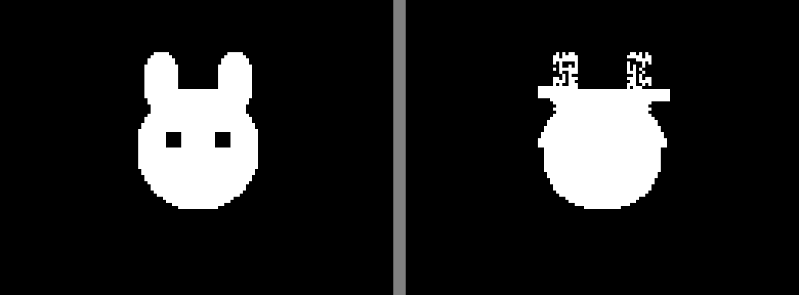
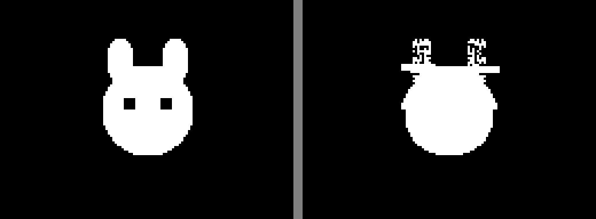
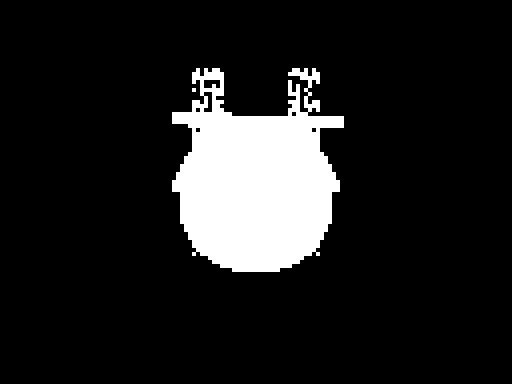

# Dual-Layer Cat (long run)

**Mode:** dual-layer (A=H-mirror | B=configurable | C=detail), 8192 pop, 16 islands, 5000 gens
**GPU:** RTX 4060 Ti, ~557K img/s
**Best fitness:** 0.0491

## Target

## Final Result (target | generated)

## Evolution

| Gen 500 (f=0.0625) | Gen 1000 (f=0.0500) | Gen 1500 (f=0.0498) |
|---|---|---|
|  |  |  |

| Gen 2000 (f=0.0498) | Gen 2500 (f=0.0498) | Gen 3000 (f=0.0498) |
|---|---|---|
|  |  |  |

| Gen 3500 (f=0.0498) | Gen 4000 (f=0.0495) | Gen 4500 (f=0.0491) |
|---|---|---|
|  |  |  |

| Gen 5000 (f=0.0491) | Final |
|---|---|
|  |  |

## Best per checkpoint

| Gen | Fitness | Image |
|-----|---------|-------|
| 500 | 0.0625 |  |
| 1000 | 0.0500 |  |
| 2000 | 0.0498 |  |
| 4000 | 0.0495 |  |
| 5000 | 0.0491 |  |
