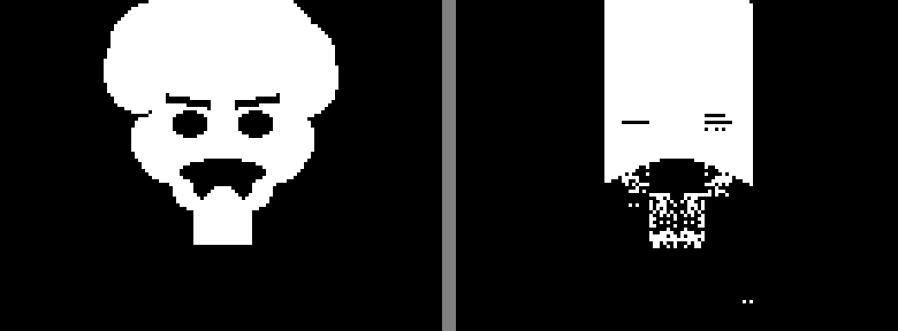

# Einstein v4 — No V-Mirror, Pure H-Mirror + Subtractive

**Mode:** 5 layers (A,B,C additive + D,E subtractive), no V-mirror, 8192 pop, 16 islands, 10000 gens
**GPU:** RTX 4060 Ti, ~496K img/s
**Best fitness:** 0.2424

Key change: removed top-bottom symmetry (V-mirror). Faces are NOT vertically
symmetric (forehead != chin). Layers B and E now use no symmetry.

Numerically worse fitness than v3, but **visually richer** — subtractive layers
successfully carve eye sockets, mustache area, and chin/mouth separation.

## Target


## Final (f=0.2424)


## Evolution

| Gen 1000 (f=0.2444) | Gen 2000 (f=0.2435) | Gen 4000 (f=0.2435) |
|---|---|---|
|  |  |  |

| Gen 6000 (f=0.2432) | Gen 8000 (f=0.2424) | Gen 10000 (f=0.2424) |
|---|---|---|
|  |  |  |

## Architecture

```
Layer A (H-mirror, additive):  head shape, hair outline
Layer B (no-sym, additive):    asymmetric features, fill
Layer C (no-sym, additive):    fine detail noise
Layer D (H-mirror, SUBTRACT):  carves eyes, nose, mouth (symmetric)
Layer E (no-sym, SUBTRACT):    asymmetric cuts, wrinkles

Result = (A | B | C | shapes) AND NOT (D | E) → threshold → binarize
```
