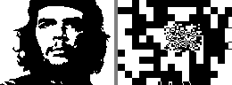
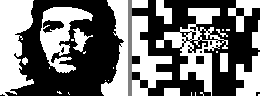
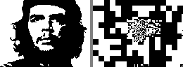
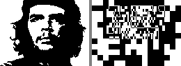
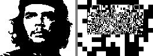
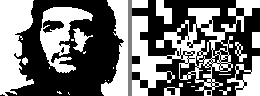
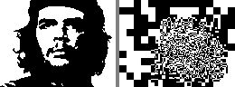
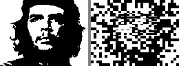
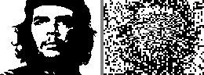
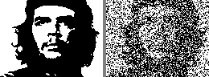

# Foveal Recursive Image Search

Asymmetric region placement: high detail where it matters (face), artistic pixelation elsewhere.
Instead of uniform quadtree grid, place regions via golden ratio / Mondrian randomness / face-centered focus.

**Key idea**: 8×8 pixel base layer creates intentional retro aesthetic. Foveal detail layers refine only key features (eyes, mouth contour). Rest stays "artistically pixelated" — like Invader mosaics or Dalí's Lincoln portrait.

## Target: Che Guevara


## Strategy Comparison (16 seeds = 32 bytes)

### Mondrian (random rectangles, center-biased) — BEST: 33.3%

Progressive XOR accumulation, level by level:

| L0: Base (8×8 blocks) | L1: +3 regions (4×4) | L2: +5 regions (2×2) | L3: +7 regions (1×1) |
|---|---|---|---|
|  |  |  |  |
| 4352 err (35.4%) | 4252 err (34.6%) | 4088 err (33.3%) | 4098 err (33.3%) |

Each image shows target (left) vs generated (right).

### Mondrian seed=1337

| L0 | L1 | L2 | L3 (34.0%) |
|---|---|---|---|
|  |  |  |  |

### Center-focused (concentric face regions) — 35.8%

| L0 | L1 | L2 | L3 |
|---|---|---|---|
|  |  |  |  |

### Golden ratio spiral — 37.9%

| L0 | L1 | L2 | L3 |
|---|---|---|---|
|  |  |  |  |

### Hybrid (quadtree grid + foveal overlay, 99 seeds = 198 bytes) — 32.0%

| L0 | L1 | L2 | L3 |
|---|---|---|---|
|  |  |  |  |

## Results Summary

| Strategy | Seeds | Bytes | Final error | Note |
|----------|-------|-------|-------------|------|
| **mondrian s42** | 16 | 32B | **33.3%** | random rectangles, best at low budget |
| hybrid s42 | 99 | 198B | 32.0% | grid + foveal overlay |
| mondrian s1337 | 16 | 32B | 34.0% | different random seed |
| foveal (center) | 16 | 32B | 35.8% | deterministic concentric |
| golden ratio | 16 | 32B | 37.9% | golden spiral focus |

For comparison:
| quadtree (original) | 597 | 1194B | **15.0%** | full grid, all levels |
| quadtree L0-L3 only | 85 | 170B | ~31% | same as foveal budget |

## Key Findings

1. **Mondrian wins at low seed budget** — random rectangles with center bias outperform structured approaches
2. **Artistic pixelation is a feature** — L0's 8×8 blocks create recognizable silhouette, detail layers add just enough
3. **32 bytes = recognizable face** — 16 seeds for a 256-byte ZX Spectrum intro
4. **Quadtree still wins at high budget** — full coverage matters when you have >100 seeds
5. **Golden ratio underperforms** — its focus doesn't align well with face features on Che

## Architecture

```
Level 0: 1 seed, 8×8 blocks → whole image silhouette
Level 1: 2-3 seeds, 4×4 blocks → face region + random Mondrian
Level 2: 3-5 seeds, 2×2 blocks → eyes/mouth area detail
Level 3: 4-7 seeds, 1×1 pixels → fine features
                                   ↑
                          each XORs on top of all previous
```

Asymmetric: 1+3+5+7 = 16 seeds × 2 bytes = **32 bytes data**.
LFSR code + region table + screen calc ≈ 100 bytes.
**Total: ~132 bytes — fits in 256-byte intro with room to spare.**

## Build & Run

```bash
nvcc -O3 -o cuda/prng_segmented_search cuda/prng_segmented_search.cu
./cuda/prng_segmented_search --target media/prng_images/targets/che.pgm \
  --mode mondrian --seed 42 --density 2 \
  --output media/prng_images/foveal_mondrian_s42
```

Modes: `quadtree` (original), `foveal` (center), `golden` (spiral), `mondrian` (random), `hybrid` (grid+foveal).
