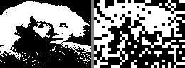
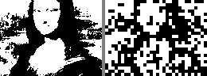

# Foveal Gallery — Face-Aware Image Search

4 iconic faces, block-scan LFSR, face-aware attention regions, Warhol pop-art.

## Face-Aware Scaling: 1×→4×

Subdivide face regions into finer tiles. More seeds = better detail where it matters.

| Scale | Seeds | Bytes | Che | Einstein | Mona Lisa |
|-------|-------|-------|-----|----------|-----------|
| **1×** | 24 | 48B | 37.5% | 34.7% | 38.7% |
| **2×** | 63 | 126B | 32.0% | 29.6% | 34.1% |
| **3×** | 126 | 252B | 28.8% | 26.5% | 30.5% |
| **4×** | 213 | 426B | **26.5%** | **24.1%** | **28.5%** |
| quadtree | 597 | 1194B | 19.3% | 19.3% | 19.0% |

~5% improvement per doubling. Linear scaling confirmed.

## Warhol Pop-Art (4× face-aware, best quality)

| Che Guevara (26.5%, 426B) | Mona Lisa (28.5%, 426B) |
|---|---|
|  |  |

## Warhol Pop-Art (Quadtree, maximum quality)

| Che (19.3%, 1194B) | Marilyn (19.2%, 1194B) | Mona Lisa (19.0%, 1194B) | Einstein (19.3%, 1194B) |
|---|---|---|---|
|  |  |  |  |

## Progressive Layers — Che Guevara

### Face-aware 4× (213 seeds, 426B)

| L0 (8×8) | L1 (4×4) | L2 (2×2) | L3 (1×1) |
|---|---|---|---|
|  |  |  |  |

### Quadtree (597 seeds, 1194B)

| L0 (8×8) | L1 (4×4) | L2 (2×2) | L3 (1×1) | L4 (fine) | L5 (overlap) |
|---|---|---|---|---|---|
|  |  |  |  |  |  |

## Progressive Layers — Einstein

### Face-aware 4× (213 seeds, 426B)

| L0 | L1 | L2 | L3 |
|---|---|---|---|
|  |  |  |  |

### Quadtree (597 seeds, 1194B)

| L0 | L1 | L2 | L3 | L4 | L5 |
|---|---|---|---|---|---|
|  |  |  |  |  |  |

## Progressive Layers — Mona Lisa

### Face-aware 4× (213 seeds, 426B)

| L0 | L1 | L2 | L3 |
|---|---|---|---|
|  |  |  |  |

### Quadtree (597 seeds, 1194B)

| L0 | L1 | L2 | L3 | L4 | L5 |
|---|---|---|---|---|---|
|  |  |  |  |  |  |

## Progressive Layers — Marilyn Monroe

### Quadtree (597 seeds, 1194B)

| L0 | L1 | L2 | L3 | L4 | L5 |
|---|---|---|---|---|---|
|  |  |  |  |  |  |

## Color Strategies (ZX Spectrum Attributes)

5 coloring methods, zero extra bytes (color derived from position/density):

| Mono | Density | Face-region | Warm/cool | Pop-art |
|---|---|---|---|---|
|  |  |  |  |  |

## Architecture

```
Face-Aware Segmentation (block-scan LFSR):

  L0: 1 seed, 8x8 blocks     [################]  whole image silhouette
  L1: grid + face subdivided  [####..####..####]  4x4 blocks, face overlap
  L2: bg corners + features   [....########....]  2x2 blocks, eyes/nose/mouth
  L3: fine detail on features  [......####......]  1x1 pixels, pupils/lips/brows

  1x = 24 seeds (48B)          <- 256-byte intro budget
  2x = 63 seeds (126B)         <- comfortable in 512B
  3x = 126 seeds (252B)        <- near quadtree quality
  4x = 213 seeds (426B)        <- best face-aware quality
  quadtree = 597 seeds (1194B) <- maximum uniform quality
```

Key: each level XORs on top of all previous (cumulative correction).
Block-scan LFSR: 1 LFSR bit = 1 block (deterministic, no random scatter).

## Build & Run

```bash
nvcc -O3 -o cuda/prng_segmented_search cuda/prng_segmented_search.cu

# Face-aware (built-in 36 seeds)
./cuda/prng_segmented_search --target targets/che.pgm --mode face --output che_face

# Face-aware scaled (from file)
python3 scripts/foveal_fast.py  # generates /tmp/faceNx_segs.txt
./cuda/prng_segmented_search --target targets/che.pgm --mode facefile --density 4 --output che_4x

# Quadtree (full coverage)
./cuda/prng_segmented_search --target targets/che.pgm --mode quadtree --density 3 --output che_qt

# Other modes: golden, mondrian, hybrid, foveal
```
