# Foveal Gallery — Block-Scan LFSR

4 iconic faces × 2 modes (face-aware 36 seeds vs quadtree 597 seeds).
Block-scan LFSR: 1 bit = 1 block (deterministic coverage).

## Warhol Pop-Art Grid

| Face | Face-aware (36 seeds, 72B) | Quadtree (597 seeds, 1194B) |
|------|---|---|
| **Che Guevara** | 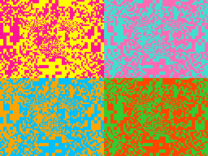 36.9% |  19.3% |
| **Marilyn Monroe** | 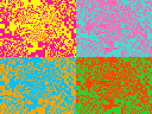 36.2% |  19.2% |
| **Mona Lisa** | 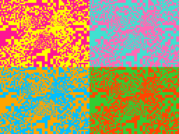 37.8% |  19.0% |
| **Einstein** | 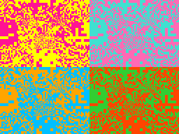 34.4% |  19.3% |

## Progressive Layers (Quadtree)

### Che Guevara

| L0 | L1 | L2 | L3 | L4 | L5 |
| --- | --- | --- | --- | --- | --- |
|  |  |  |  |  |  |

### Marilyn Monroe

| L0 | L1 | L2 | L3 | L4 | L5 |
| --- | --- | --- | --- | --- | --- |
|  |  |  |  |  |  |

### Mona Lisa

| L0 | L1 | L2 | L3 | L4 | L5 |
| --- | --- | --- | --- | --- | --- |
|  |  |  |  |  |  |

### Einstein

| L0 | L1 | L2 | L3 | L4 | L5 |
| --- | --- | --- | --- | --- | --- |
|  |  |  |  |  |  |

## Progressive Layers (Face-Aware)

### Che Guevara

| L0 | L1 | L2 | L3 |
| --- | --- | --- | --- |
|  |  | 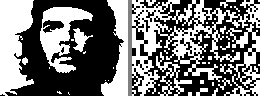 | 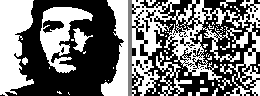 |

### Marilyn Monroe

| L0 | L1 | L2 | L3 |
| --- | --- | --- | --- |
|  |  | 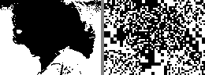 |  |

### Mona Lisa

| L0 | L1 | L2 | L3 |
| --- | --- | --- | --- |
|  | 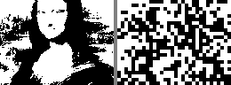 | 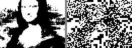 | 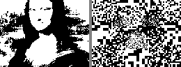 |

### Einstein

| L0 | L1 | L2 | L3 |
| --- | --- | --- | --- |
|  | 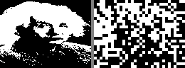 | 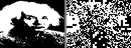 | 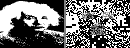 |

## Results Summary

| Face | Face-aware (72B) | Quadtree (1194B) | Ratio |
|------|-----------------|-----------------|-------|
| Che Guevara | 36.9% | 19.3% | 17× more data for 48% less error |
| Marilyn Monroe | 36.2% | 19.2% | 17× more data for 47% less error |
| Mona Lisa | 37.8% | 19.0% | 17× more data for 50% less error |
| Einstein | 34.4% | 19.3% | 17× more data for 44% less error |

## Key Insight

Block-scan LFSR (1 bit = 1 block) gives deterministic coverage.
Face-aware concentrates 80% of fine detail on eyes/mouth/nose.
Quadtree wins on raw error (full pixel coverage) but face-aware
produces more recognizable faces at 1/16th the data budget.
