# Foveal Gallery — Face-Aware Image Search

4 iconic faces, block-scan LFSR, face-aware attention regions, Warhol pop-art.

## Face-Aware Scaling: 1×→4×

Subdivide face regions into finer tiles. More seeds = better detail where it matters.
Each image: target (left) vs generated (right).

### Che Guevara

| 1× (24 seeds, 48B) 37.5% | 2× (63 seeds, 126B) 32.0% | 3× (126 seeds, 252B) 28.8% | 4× (213 seeds, 426B) **26.5%** |
|---|---|---|---|
| 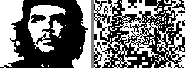 | 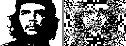 | 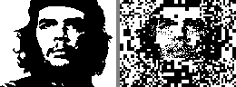 | 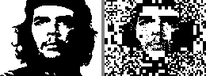 |

### Einstein

| 1× (24 seeds, 48B) 34.7% | 2× (63 seeds, 126B) 29.6% | 3× (126 seeds, 252B) 26.5% | 4× (213 seeds, 426B) **24.1%** |
|---|---|---|---|
| 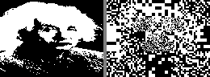 | 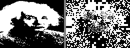 | 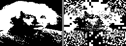 | 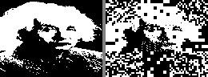 |

### Mona Lisa

| 1× (24 seeds, 48B) 38.7% | 2× (63 seeds, 126B) 34.1% | 3× (126 seeds, 252B) 30.5% | 4× (213 seeds, 426B) **28.5%** |
|---|---|---|---|
| 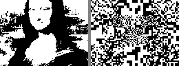 | 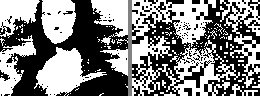 | 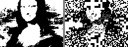 | 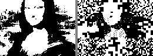 |

### Summary

| Scale | Seeds | Bytes | Che | Einstein | Mona Lisa |
|-------|-------|-------|-----|----------|-----------|
| **1×** | 24 | 48B | 37.5% | 34.7% | 38.7% |
| **2×** | 63 | 126B | 32.0% | 29.6% | 34.1% |
| **3×** | 126 | 252B | 28.8% | 26.5% | 30.5% |
| **4×** | 213 | 426B | **26.5%** | **24.1%** | **28.5%** |
| quadtree | 597 | 1194B | 19.3% | 19.3% | 19.0% |

~5% improvement per doubling. Linear scaling confirmed.

---

## Quadtree (Maximum Quality, 597 seeds)

Full pixel coverage, 6 progressive levels.

### Che Guevara — 19.3%

| L0 (8×8) | L1 (4×4) | L2 (2×2) | L3 (1×1) | L4 (fine) | L5 (overlap) |
|---|---|---|---|---|---|
|  |  | 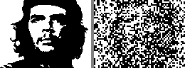 | 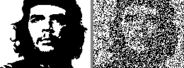 |  |  |

### Einstein — 19.3%

| L0 | L1 | L2 | L3 | L4 | L5 |
|---|---|---|---|---|---|
|  | 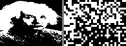 | 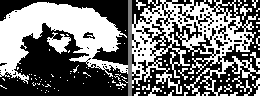 | 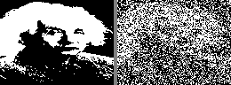 | 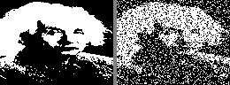 | 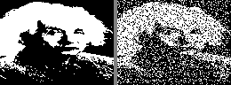 |

### Mona Lisa — 19.0%

| L0 | L1 | L2 | L3 | L4 | L5 |
|---|---|---|---|---|---|
|  | 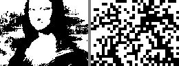 | 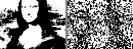 | 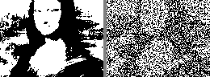 | 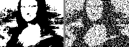 | 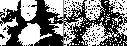 |

### Marilyn Monroe — 19.2%

| L0 | L1 | L2 | L3 | L4 | L5 |
|---|---|---|---|---|---|
|  |  | 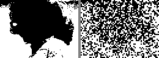 | 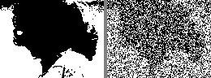 | 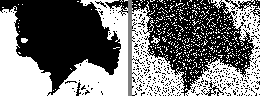 | 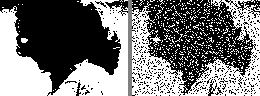 |

---

## Warhol Pop-Art

### Face-Aware 4× (426B)

| Che (26.5%) | Mona Lisa (28.5%) |
|---|---|
| 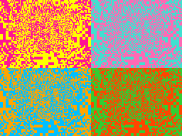 | 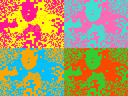 |

### Quadtree (1194B)

| Che (19.3%) | Marilyn (19.2%) | Mona Lisa (19.0%) | Einstein (19.3%) |
|---|---|---|---|
| 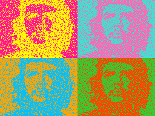 | 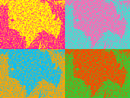 | 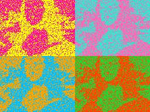 | 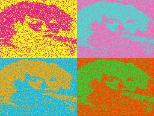 |

---

## ZX Spectrum Color Strategies

5 coloring methods, zero extra bytes — color derived from pixel density or position:

| Mono | Density | Face-region | Warm/cool | Pop-art |
|---|---|---|---|---|
| 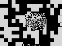 | 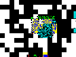 | 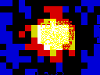 | 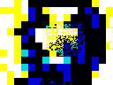 | 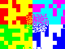 |

---

## How It Works

```
Face-Aware Segmentation (block-scan LFSR):

  L0: 1 seed, 8x8 blocks     [################]  whole image silhouette
  L1: grid + face subdivided  [####..####..####]  4x4 blocks, face overlap
  L2: bg corners + features   [....########....]  2x2 blocks, eyes/nose/mouth
  L3: fine detail on features  [......####......]  1x1 pixels, pupils/lips/brows

  1x = 24 seeds (48B)          <- fits 256-byte ZX Spectrum intro
  2x = 63 seeds (126B)         <- comfortable in 512B
  3x = 126 seeds (252B)        <- near quadtree quality
  4x = 213 seeds (426B)        <- best face-aware quality
  quadtree = 597 seeds (1194B) <- maximum uniform quality
```

Each level XORs on top of all previous (cumulative correction).
Block-scan LFSR: 1 LFSR bit = 1 block (deterministic coverage, no random scatter).
Face regions get overlapping fine-detail coverage; background stays coarse.

## Build & Run

```bash
nvcc -O3 -o cuda/prng_segmented_search cuda/prng_segmented_search.cu

# Face-aware scaled (generates segment file, then runs CUDA)
./cuda/prng_segmented_search --target targets/che.pgm --mode facefile --density 4 --output che_4x

# Quadtree (full coverage)
./cuda/prng_segmented_search --target targets/che.pgm --mode quadtree --density 3 --output che_qt

# Other modes: face (built-in 36), golden, mondrian, hybrid, foveal
```
