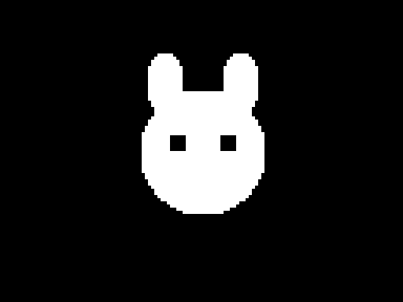
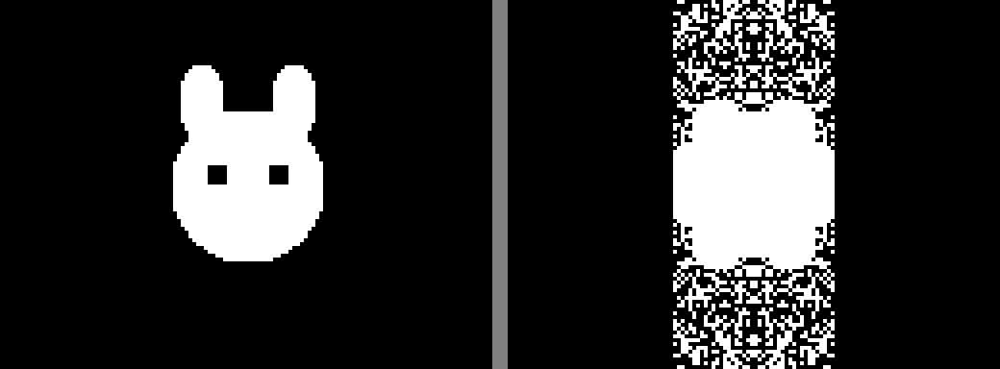
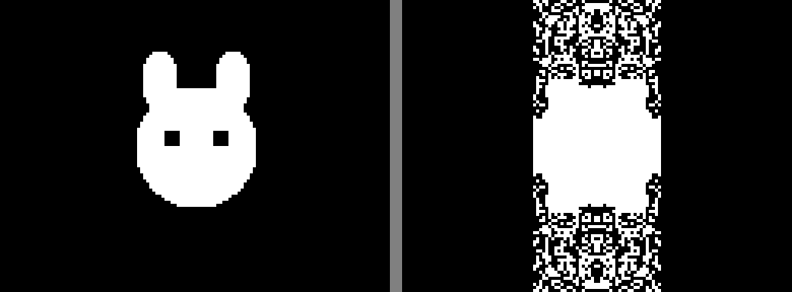
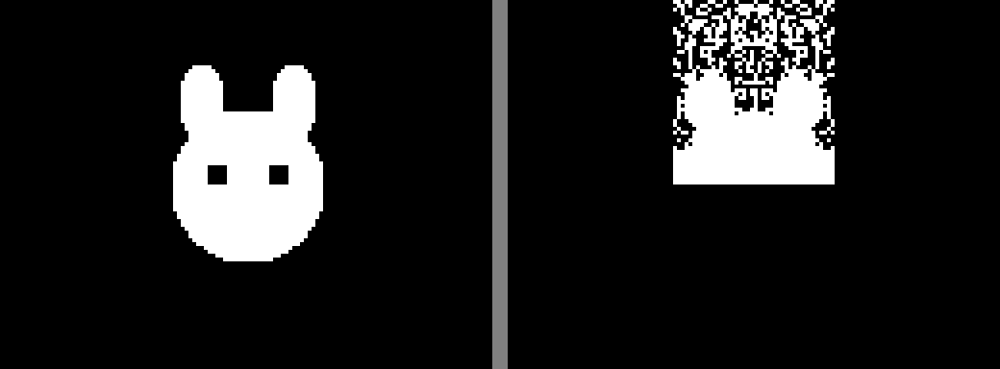

# Single-Layer Cat (baseline)

**Mode:** single-layer, 4096 pop, 8 islands, forced sym diversity, 500 gens
**GPU:** RTX 4060 Ti, ~948K img/s
**Best fitness:** 0.2844

Baseline single-layer search. All symmetry modes explored via island diversity.
Winner: sym=1 (H-mirror). Later superseded by dual-layer (5.8x better).

## Target

## Final Result (target | generated)

## Evolution

| Gen 100 (f=0.3000) | Gen 200 (f=0.2980) | Gen 300 (f=0.2844) |
|---|---|---|
|  |  |  |

| Gen 400 (f=0.2844) | Gen 500 (f=0.2844) |
|---|---|
|  |  |
