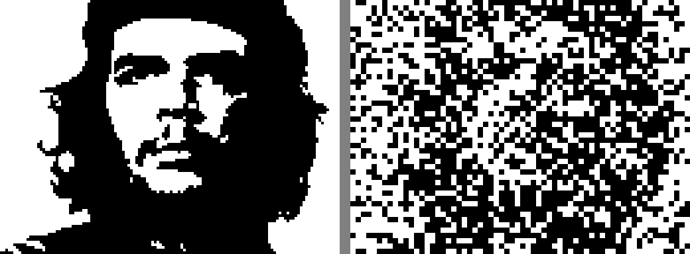
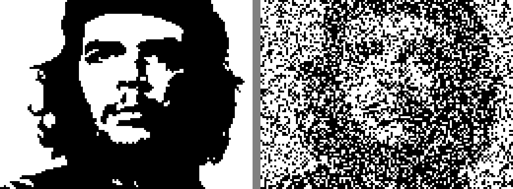
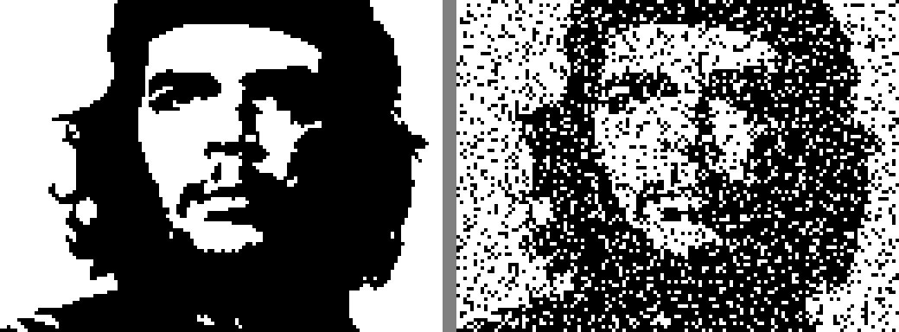

# Segmented Hierarchical v2 — Che Guevara (6 levels)

**Method:** 6 levels of hierarchical XOR correction with overlapping fine tiles.
**Best: 15.0% error from 597 seeds = 1194 bytes.**

## Target

## Progression

| Level 0: 8x8, 1 seed (35.4%) | Level 1: 4x4, +4 seeds (34.5%) | Level 2: 2x2, +16 seeds (32.3%) |
|---|---|---|
|  |  |  |

| Level 3: 1x1, +64 seeds (31.2%) | Level 4: 1x1 fine, +256 seeds (18.5%) | Level 5: 1x1 overlap, +256 seeds (15.0%) |
|---|---|---|
|  |  |  |

## Segment Budget

| Level | New Seeds | Total | Block | Coverage | Error |
|-------|-----------|-------|-------|----------|-------|
| 0 | 1 | 1 | 8x8 | whole 128x96 | 35.4% |
| 1 | 4 | 5 | 4x4 | 4 quadrants | 34.5% |
| 2 | 16 | 21 | 2x2 | 16 tiles 32x24 | 32.3% |
| 3 | 64 | 85 | 1x1 | 64 tiles 16x12 | 31.2% |
| 4 | 256 | 341 | 1x1 | 256 tiles 8x6 | **18.5%** |
| 5 | 256 | 597 | 1x1 | 256 overlap tiles | **15.0%** |

Key insight: Levels 4-5 halve the error because each seed only needs to match
~48 pixels (8x6 tile). 65536 LFSR candidates for 48 bits = excellent coverage.
